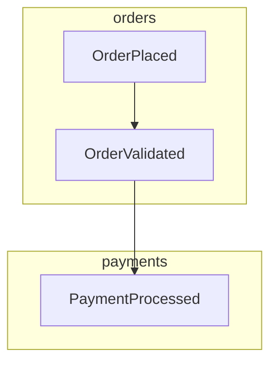
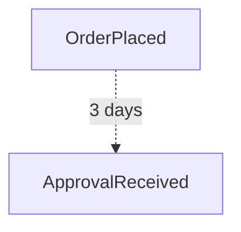

# seesaw-viz

Workflow visualization and observability for Seesaw event-driven runtime.

## Features

- ✅ **Non-blocking span collection** via async channels (P1)
- ✅ **Parent-child causality tracking** via `parent_event_id` (P0)
- ✅ **Component grouping** using `module_path!()` for Mermaid subgraphs (P2)
- ✅ **State diffing** with customizable formatters
- ✅ **Sampling strategies** for overhead reduction
- 🚧 **Live HTML viewer** (coming soon - P3)

## Quick Start

```toml
[dependencies]
seesaw-viz = "0.1"
```

```rust
use seesaw_viz::{SpanCollector, JsonDiffFormatter, RenderOptions, MermaidRenderer};

// Create collector with async channel (non-blocking)
let collector = SpanCollector::new(1000); // Buffer size

// Create observer for Seesaw's on_any()
let observer = collector.create_observer(JsonDiffFormatter);

// Attach to Seesaw engine
let engine = Engine::new()
    .with_effect(
        effect::on_any().then(move |event, ctx| {
            let observer = observer.clone();
            async move {
                // Record span (happens off the hot path via channel)
                observer.record(
                    event.id,
                    event.type_name(),
                    event.type_id(),
                    event.parent_event_id,
                    Some(module_path!().to_string()),
                    Some("my_effect".into()),
                    Some(ctx.prev_state().clone()),
                    Some(ctx.next_state().clone()),
                ).await?;

                Ok(())
            }
        })
    );

// Generate Mermaid diagram
let graph = collector.graph().await;
let renderer = MermaidRenderer::new(RenderOptions {
    group_by_component: true, // P2: Subgraphs by module
    show_timings: true,
    ..Default::default()
});

let diagram = renderer.render(&graph);
println!("{}", diagram);
```

## Architecture

### Priority 0: Parent-Child Mapping (Essential)

Tracks causality via `parent_event_id` to reconstruct event chains:

```rust
Event A (parent: None)
  → Event B (parent: A)
    → Event C (parent: B)
```

### Priority 1: Async Span Channel (Performance)

Span collection happens off the hot path using `tokio::mpsc`:

```
Effect → Send to Channel → Background Task → Build Graph
```

No `Mutex<Vec<...>>` blocking. Zero impact on engine latency.

### Priority 2: Component Grouping (Clarity)

Uses `module_path!()` to create Mermaid subgraphs:



Prevents "spaghetti" diagrams at scale.

### Priority 3: Live HTML Viewer (Coming Soon)

Axum-based live viewer with real-time updates:

```rust
use seesaw_viz::web::start_viewer;

start_viewer(collector, "127.0.0.1:3000").await?;
// Open http://localhost:3000
```

## Sampling Strategies

Reduce overhead by sampling events:

```rust
use seesaw_viz::sampling::{RateSample, EventTypeSampler, AnyOfSampler};

// Sample 10% of events
let collector = SpanCollector::new(1000)
    .with_sampler(RateSample::new(10));

// Only sample specific event types
let collector = SpanCollector::new(1000)
    .with_sampler(EventTypeSampler::new(vec![
        "Order".into(),
        "Payment".into()
    ]));

// Composite: sample Order events OR 10% of everything else
let collector = SpanCollector::new(1000)
    .with_sampler(AnyOfSampler::new(vec![
        Arc::new(EventTypeSampler::new(vec!["Order".into()])),
        Arc::new(RateSample::new(10)),
    ]));
```

## State Formatting

Customize state diffing:

```rust
use seesaw_viz::{StateFormatter, JsonDiffFormatter, CompactFormatter};

// Default: JSON diff showing old/new values
let observer = collector.create_observer(JsonDiffFormatter);

// Compact: Only show changed fields
let observer = collector.create_observer(CompactFormatter);

// Custom formatter
struct MyFormatter;
impl StateFormatter<MyState> for MyFormatter {
    fn serialize(&self, state: &MyState) -> Result<Value, FormatterError> {
        // Custom serialization logic
    }

    fn diff(&self, prev: &MyState, next: &MyState) -> Result<Option<Value>, FormatterError> {
        // Custom diff logic
    }
}
```

## Render Options

```rust
let renderer = MermaidRenderer::new(RenderOptions {
    show_state_diffs: true,      // Include state changes in nodes
    show_timings: true,           // Show effect duration
    group_by_component: true,     // Subgraphs by module_path
    max_depth: Some(5),           // Limit tree depth
    failed_only: false,           // Show only failed spans
    direction: "LR".into(),       // "TD" or "LR"
});
```

## Performance Considerations

1. **Async Channel**: Span collection is non-blocking via `tokio::mpsc`
2. **Sampling**: Use `RateSample` to reduce overhead in high-throughput systems
3. **State Diffing**: Disable with `collect_state: false` if not needed
4. **Max Spans**: Set `max_spans: Some(10_000)` to prevent memory growth

## Delayed Events & Temporal Gaps

For timer-triggered or scheduled events, use dashed edges to indicate temporal breaks:



(Note: Requires manual annotation for now - automatic detection coming soon)

## License

MIT OR Apache-2.0
