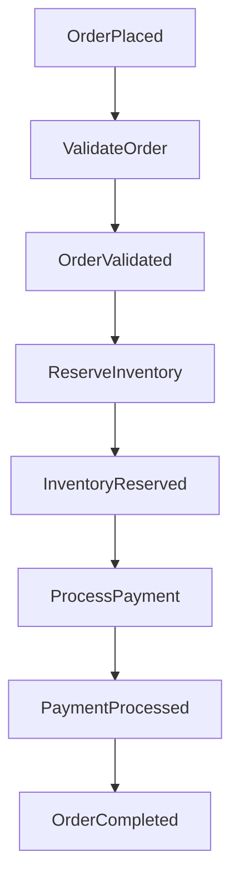

# Seesaw Enhancement Patterns

## Overview

This plan explores integration patterns for extending Seesaw's event-driven runtime with advanced capabilities while maintaining its minimalist philosophy. The goal is to provide **seamless, ergonomic patterns** for job queues, saga orchestration, distributed systems (NATS), state machines, workflows, observability (OTEL), and edge computing deployment.

**Key Principle**: Seesaw remains a lightweight event-driven runtime. These enhancements are **patterns and integration guides**, not framework additions. We avoid turning Seesaw into a saga engine, workflow orchestrator, or distributed actor system.

### Critical Guardrails (Incorporated from Feedback)

This plan has been hardened with the following protections:

1. **Anti-Patterns First** (Phase 0): Document what Seesaw is NOT before documenting patterns
2. **Idempotency Mandatory**: All external integration patterns include re-entrancy guards
3. **No Integration Crates**: Provide copy-paste patterns, not maintenance-heavy crates
4. **State Machine Decision Rule**: <10 transitions = stay implicit, >10 = consider library
5. **Observability Tiered**: Basic → Intermediate → Advanced (prevents overwhelm)
6. **Visualization Clarity**: Diagnostic only, not semantic
7. **WASM Size Warnings**: Document Cloudflare Workers binary limits
8. **Libraries Over Abstractions Checklist**: Every pattern must pass enforcement checklist

The maturity path is **proven patterns**, not feature creep.

## Problem Statement

Seesaw currently excels at:
- Simple event → effect → event flows
- Local state management
- Cross-domain event coordination
- Edge function patterns

However, users need guidance on:
1. **Job Queue Integration** - Reliable background processing with retries
2. **Saga Patterns** - Long-running workflows with compensation
3. **Distributed Deployment** - Multi-instance coordination via NATS/Redis
4. **State Machine Formalization** - Complex state transitions with guards
5. **Workflow Visualization** - Understanding event flows
6. **Observability** - Tracing event chains with OpenTelemetry
7. **Edge Computing** - Serverless deployment patterns (Lambda, Cloudflare Workers)

**Gap**: Lack of documented patterns and example implementations for these scenarios.

## Research Findings

### Repository Research
- **Current Architecture**: Event → Reducer → Effect → Event flow
- **Philosophy**: "Events are signals. Effects react and return new events."
- **Stateless Engine**: v0.7.x design is serverless-ready
- **Dependencies**: Minimal (tokio, anyhow, serde) - fast cold starts
- **Existing Patterns**: Transactional outbox, request/response, cross-domain reactions

### External Best Practices (2026)
- **Job Queues**: `apalis` (Rust-native), `asynq` (Redis-backed distributed)
- **Retry Logic**: `tokio-retry` with exponential backoff + jitter
- **Saga Patterns**: Choreography > Orchestration for loose coupling
- **Distributed Messaging**: NATS JetStream (exactly-once semantics)
- **State Machines**: Type-state pattern, `statig` for hierarchical async FSMs
- **Observability**: `tracing-opentelemetry` for distributed tracing
- **Durable Workflows**: Restate/Temporal for long-running sagas

### Key Insights
1. **Transactional Outbox** is the gold standard for reliable event publishing
2. **Context Propagation** through event metadata enables distributed tracing
3. **Choreography-based sagas** align perfectly with Seesaw's decentralized model
4. **Stateless engine design** makes Seesaw ideal for serverless/edge deployment
5. **Effect boundaries** are natural span creation points for observability

## Proposed Solution

Enhance Seesaw with **documented patterns and optional integration examples** across seven categories.

### Philosophy Enforcement: "Libraries Over Abstractions" Checklist

Every pattern in this plan must pass this checklist:

**This pattern introduces:**
- [ ] New runtime concepts (❌ reject)
- [ ] New DSLs (❌ reject)
- [ ] Hidden state (❌ reject)
- [x] Plain Rust + direct library usage (✅ accept)

If a pattern introduces runtime concepts, DSLs, or hidden state, it does not belong in Seesaw.

### 1. Job Queue Integration Patterns

**Pattern**: Effects dispatch to job queues; job workers emit completion events back to Seesaw.

**Implementation Options**:

#### Option A: Tokio Channels (In-Process)
```rust
// Simple bounded channel for backpressure
pub struct InProcessJobQueue {
    tx: mpsc::Sender<Job>,
}

impl InProcessJobQueue {
    pub async fn enqueue(&self, job: Job) -> Result<()> {
        self.tx.send(job).await?;
        Ok(())
    }
}

// Effect enqueues job
effect::on::<OrderPlaced>().then(|event, ctx| async move {
    ctx.deps().job_queue.enqueue(ProcessOrderJob {
        order_id: event.order_id,
        priority: event.priority,
    }).await?;
    Ok(JobEnqueued { order_id: event.order_id })
});

// Worker pool processes jobs and dispatches events to Seesaw
async fn job_worker(mut rx: mpsc::Receiver<Job>, engine: Engine<State, Deps>) {
    while let Some(job) = rx.recv().await {
        let event = match job.process().await {
            Ok(result) => JobCompleted { job_id: job.id, result },
            Err(e) => JobFailed { job_id: job.id, error: e.to_string() },
        };

        // Dispatch completion event back to Seesaw engine
        let handle = engine.activate(State::default());
        handle.run(|_ctx| Ok(event)).unwrap();
        handle.settled().await.unwrap();
    }
}
```

**⚠️ Critical: Idempotency & Re-entrancy**

When external systems (job workers, webhooks, NATS subscribers) dispatch events back to Seesaw, you **must** prevent event amplification loops:

```rust
// ❌ BAD: Infinite loop risk
effect::on::<JobCompleted>().then(|event, ctx| async move {
    // This enqueues another job that emits JobCompleted again!
    ctx.deps().job_queue.enqueue(ProcessJob { id: event.job_id }).await?;
    Ok(JobEnqueued { job_id: event.job_id })
});

// ✅ GOOD: Use correlation IDs and guards
effect::on::<JobCompleted>().then(|event, ctx| async move {
    // Check if this job was originated by us
    if event.correlation_id == ctx.instance_id() {
        return Ok(()); // Ignore our own events
    }

    // Or check if already processed
    if ctx.deps().db.job_processed(event.job_id).await? {
        return Ok(()); // Idempotent: already handled
    }

    ctx.deps().db.mark_job_processed(event.job_id).await?;
    Ok(NotificationSent { job_id: event.job_id })
});
```

**Idempotency Rules:**
1. **External → Internal boundary**: Always attach `correlation_id` or `source`
2. **Effect guards**: Check if event already processed (use DB, state, or event ID)
3. **No blind re-triggering**: Effects should not re-emit the same event type without explicit intent

**Pattern: Correlation ID**
```rust
#[derive(Debug, Clone)]
pub struct Event {
    pub id: Uuid,
    pub correlation_id: Uuid, // Tracks originating request/saga
    pub data: EventData,
}
```

#### Option B: Apalis (Production-Grade)
```rust
use apalis::prelude::*;

// Define job
#[derive(Debug, Clone, Serialize, Deserialize)]
struct ProcessOrderJob {
    order_id: Uuid,
}

async fn process_order(job: ProcessOrderJob, ctx: JobContext) -> Result<()> {
    // Process job
    ctx.deps().order_service.process(job.order_id).await?;

    // Dispatch completion event back to Seesaw engine
    let engine = ctx.deps().seesaw_engine;
    let handle = engine.activate(State::default());
    handle.run(|_ctx| Ok(OrderProcessed {
        order_id: job.order_id
    }))?;
    handle.settled().await?;

    Ok(())
}

// Effect enqueues via apalis
effect::on::<OrderPlaced>().then(|event, ctx| async move {
    ctx.deps().apalis_client.push(ProcessOrderJob {
        order_id: event.order_id,
    }).await?;
    Ok(JobEnqueued { order_id: event.order_id })
});
```

#### Option C: Asynq (Distributed Redis)
```rust
use asynq::*;

// Effect enqueues distributed job
effect::on::<OrderPlaced>().then(|event, ctx| async move {
    let client = ctx.deps().asynq_client;

    client.enqueue(
        ProcessOrderTask {
            order_id: event.order_id,
        },
        QueueOptions::new()
            .queue("critical")
            .max_retry(3)
            .timeout(Duration::from_secs(30))
    ).await?;

    Ok(JobEnqueued { order_id: event.order_id })
});
```

**Retry Pattern with tokio-retry**:
```rust
use tokio_retry::{strategy::ExponentialBackoff, Retry};

effect::on::<JobFailed>().then(|event, ctx| async move {
    let retry_strategy = ExponentialBackoff::from_millis(100)
        .max_delay(Duration::from_secs(30))
        .take(5); // Max 5 retries

    let result = Retry::spawn(retry_strategy, || {
        ctx.deps().job_processor.retry_job(event.job_id)
    }).await;

    match result {
        Ok(_) => Ok(JobRetrySucceeded { job_id: event.job_id }),
        Err(_) => Ok(JobPermanentlyFailed { job_id: event.job_id }),
    }
});
```

**Documentation Additions**:
- `docs/patterns/job-queues.md` - Integration guide
- `examples/job-queue-worker/` - Working example with apalis
- CLAUDE.md section on job queue patterns

### 2. Saga Pattern Implementation

**Pattern**: Choreography-based sagas with compensation events.

**Forward Transaction**:
```rust
// Saga step 1: Reserve inventory
effect::on::<OrderPlaced>().then(|event, ctx| async move {
    match ctx.deps().inventory.reserve(&event.items).await {
        Ok(reservation) => Ok(InventoryReserved {
            order_id: event.order_id,
            reservation_id: reservation.id,
        }),
        Err(e) => Ok(InventoryReserveFailed {
            order_id: event.order_id,
            reason: e.to_string(),
        }),
    }
});

// Saga step 2: Process payment
effect::on::<InventoryReserved>().then(|event, ctx| async move {
    match ctx.deps().payment.charge(&event).await {
        Ok(payment) => Ok(PaymentProcessed {
            order_id: event.order_id,
            payment_id: payment.id,
        }),
        Err(e) => Ok(PaymentFailed {
            order_id: event.order_id,
            reason: e.to_string(),
        }),
    }
});

// Saga step 3: Terminal success
effect::on::<PaymentProcessed>().then(|event, ctx| async move {
    Ok(OrderCompleted { order_id: event.order_id })
});
```

**Compensation Transaction**:
```rust
// Compensate: Release inventory on payment failure
effect::on::<PaymentFailed>().then(|event, ctx| async move {
    ctx.deps().inventory.release(event.order_id).await?;
    Ok(InventoryReleased { order_id: event.order_id })
});

// Compensate: Cancel order
effect::on::<InventoryReleased>().then(|event, ctx| async move {
    Ok(OrderCancelled { order_id: event.order_id })
});
```

**Saga State Tracking** (optional):
```rust
// Track saga progress in database
#[derive(Debug, Clone)]
pub struct SagaState {
    correlation_id: Uuid,
    status: SagaStatus,
    completed_steps: Vec<String>,
    started_at: DateTime<Utc>,
}

#[derive(Debug, Clone, PartialEq)]
pub enum SagaStatus {
    InProgress,
    Completed,
    Compensating,
    Failed,
}

// Reducer tracks saga state
let saga_reducer = reducer::fold::<SagaEvent>().into(|mut state, event| {
    match event {
        SagaEvent::Started { correlation_id } => {
            state.sagas.insert(correlation_id, SagaState {
                correlation_id,
                status: SagaStatus::InProgress,
                completed_steps: vec![],
                started_at: Utc::now(),
            });
        }
        SagaEvent::StepCompleted { correlation_id, step } => {
            if let Some(saga) = state.sagas.get_mut(&correlation_id) {
                saga.completed_steps.push(step);
            }
        }
        SagaEvent::Failed { correlation_id } => {
            if let Some(saga) = state.sagas.get_mut(&correlation_id) {
                saga.status = SagaStatus::Compensating;
            }
        }
        SagaEvent::Completed { correlation_id } => {
            if let Some(saga) = state.sagas.get_mut(&correlation_id) {
                saga.status = SagaStatus::Completed;
            }
        }
    }
    state
});
```

**Timeout Handling**:
```rust
// Effect schedules timeout check
effect::on::<SagaStarted>().then(|event, ctx| async move {
    // Schedule timeout check (5 minutes)
    ctx.deps().scheduler.schedule_after(
        Duration::from_secs(300),
        CheckSagaTimeout { correlation_id: event.correlation_id }
    ).await?;
    Ok(())
});

// Timeout checker emits failure if not complete
effect::on::<CheckSagaTimeout>().then(|event, ctx| async move {
    let saga_state = ctx.deps().saga_store.get(event.correlation_id).await?;

    if !matches!(saga_state.status, SagaStatus::Completed) {
        Ok(SagaTimedOut { correlation_id: event.correlation_id })
    } else {
        Ok(()) // Saga completed, no timeout event
    }
});
```

**Critical: Saga Idempotency in Choreography**

In choreography, effects may receive the same event twice due to network retries. Every forward saga step MUST be idempotent:

```rust
effect::on::<InventoryReserved>().then(|event, ctx| async move {
    // Check if payment already processed for this reservation
    if ctx.deps().db.payment_exists_for_reservation(event.reservation_id).await? {
        return Ok(()); // Already processed, skip
    }

    // Process payment with idempotency key
    let payment = ctx.deps().payment.charge_idempotent(
        event.order_id,
        event.reservation_id // Use as idempotency key
    ).await?;

    Ok(PaymentProcessed {
        order_id: event.order_id,
        payment_id: payment.id,
        reservation_id: event.reservation_id, // Carry correlation
    })
});
```

**Idempotency Strategies**:
1. **Database check**: Query if action already performed
2. **Idempotency keys**: Use `reservation_id`, `order_id`, or `correlation_id`
3. **State guards**: Check reducer state before executing effect

**Documentation Additions**:
- `docs/patterns/sagas.md` - Comprehensive saga guide (with idempotency section)
- `examples/saga-order-workflow/` - Full saga example with compensation
- CLAUDE.md section on saga patterns

### 3. Distributed Systems Integration (NATS)

**Pattern**: Use NATS JetStream for multi-instance event distribution.

**Architecture**:
```
┌─────────────────┐
│ Seesaw Instance │──┐
│  (us-east-1a)   │  │
└─────────────────┘  │
                     ├──> NATS JetStream ──> Stream: SEESAW_EVENTS
┌─────────────────┐  │
│ Seesaw Instance │──┘
│  (us-west-2b)   │
└─────────────────┘
```

**Implementation**:
```rust
use async_nats::jetstream;

pub struct DistributedSeesawRuntime {
    engine: Engine<State, Deps>,
    nats_client: async_nats::Client,
    instance_id: String,
}

impl DistributedSeesawRuntime {
    pub async fn new(nats_url: &str, instance_id: String) -> Result<Self> {
        let client = async_nats::connect(nats_url).await?;

        Ok(Self {
            engine: build_engine(),
            nats_client: client,
            instance_id,
        })
    }

    pub async fn run(&self) -> Result<()> {
        let jetstream = jetstream::new(self.nats_client.clone());

        // Ensure stream exists
        let stream = jetstream.get_or_create_stream(jetstream::stream::Config {
            name: "SEESAW_EVENTS".to_string(),
            subjects: vec!["events.>".to_string()],
            retention: jetstream::stream::RetentionPolicy::WorkQueue,
            ..Default::default()
        }).await?;

        // Create durable consumer for this instance
        let consumer = stream.create_consumer(jetstream::consumer::pull::Config {
            durable_name: Some(format!("instance_{}", self.instance_id)),
            ack_policy: jetstream::consumer::AckPolicy::Explicit,
            ..Default::default()
        }).await?;

        // Process messages
        let mut messages = consumer.messages().await?;

        while let Some(msg) = messages.next().await {
            let event: Event = serde_json::from_slice(&msg.payload)?;

            // Process event in Seesaw
            let handle = self.engine.activate(State::default());
            handle.run(|_ctx| Ok(event.clone())).await?;
            handle.settled().await?;

            // Acknowledge processing
            msg.ack().await?;
        }

        Ok(())
    }

    pub async fn publish_event(&self, event: &Event) -> Result<()> {
        let jetstream = jetstream::new(self.nats_client.clone());

        let ack = jetstream.publish(
            format!("events.{}", event.type_name()),
            serde_json::to_vec(event)?.into()
        ).await?;

        tracing::info!(
            sequence = ack.sequence,
            event_type = event.type_name(),
            "Published event to NATS"
        );

        Ok(())
    }
}
```

**Effect Publishing to NATS**:
```rust
// Effects publish terminal events to NATS for cross-instance distribution
effect::on::<OrderCompleted>().then(|event, ctx| async move {
    // Publish to NATS for other instances
    ctx.deps().nats_runtime.publish_event(&event).await?;
    Ok(())
});
```

**State Synchronization via NATS KV**:
```rust
// Use NATS Key-Value for distributed state
pub async fn sync_state_via_nats(jetstream: jetstream::Context) -> Result<()> {
    let kv = jetstream.create_key_value(jetstream::kv::Config {
        bucket: "seesaw_state".to_string(),
        history: 10,
        ..Default::default()
    }).await?;

    // Write state updates
    kv.put("order_count", b"42").await?;

    // Read state
    let entry = kv.get("order_count").await?;
    let count: u64 = String::from_utf8(entry.value.to_vec())?.parse()?;

    // Watch for changes
    let mut watcher = kv.watch("order_*").await?;
    while let Some(entry) = watcher.next().await {
        tracing::info!("State changed: {} = {:?}", entry.key, entry.value);
    }

    Ok(())
}
```

**Documentation Additions**:
- `docs/patterns/distributed-nats.md` - NATS integration guide
- `examples/distributed-nats/` - Multi-instance example
- `Cargo.toml` feature flag: `nats` (optional dependency)

### 4. State Machine Patterns

**Pattern**: Implicit state machines via reducers + explicit FSMs for complex logic.

**Decision Rule**: If your state transitions fit in a reducer with <10 transitions, **do not** use an FSM library. Stay implicit.

| Scenario | Use Implicit (Enum + Reducer) | Use Explicit (statig) |
|----------|------------------------------|----------------------|
| Simple order flow (3-5 states) | ✅ Yes | ❌ Overkill |
| Payment processing (5-8 states) | ✅ Yes | ⚠️ Optional |
| Complex workflow (10+ states, nested) | ❌ Too brittle | ✅ Use library |
| Hierarchical states (substates) | ❌ Hard to manage | ✅ Use library |

#### Implicit State Machine (Recommended)
```rust
#[derive(Debug, Clone, Copy, PartialEq)]
pub enum OrderState {
    Pending,
    Processing { started_at: DateTime<Utc> },
    Completed { completed_at: DateTime<Utc> },
    Failed { reason: &'static str },
}

impl OrderState {
    pub fn transition(&self, event: &OrderEvent) -> Result<Self> {
        use OrderState::*;
        use OrderEvent::*;

        match (self, event) {
            (Pending, StartProcessing { time }) =>
                Ok(Processing { started_at: *time }),
            (Processing { .. }, Complete { time }) =>
                Ok(Completed { completed_at: *time }),
            (Processing { .. }, Fail { reason, .. }) =>
                Ok(Failed { reason }),
            _ => Err(anyhow!("Invalid state transition: {:?} -> {:?}", self, event)),
        }
    }

    pub fn is_terminal(&self) -> bool {
        matches!(self, Completed { .. } | Failed { .. })
    }
}

// Reducer enforces state transitions
let state_reducer = reducer::fold::<OrderEvent>().into(|state, event| {
    let new_order_state = state.order_state.transition(&event)?;
    State {
        order_state: new_order_state,
        ..state
    }
});
```

#### Explicit State Machine with `statig` (Complex Cases)
```rust
use statig::prelude::*;

#[derive(Default)]
pub struct PaymentStateMachine;

pub enum State {
    Idle,
    Authorizing,
    Capturing,
    Completed,
    Refunding,
    Refunded,
}

pub enum Event {
    Authorize,
    AuthorizationSucceeded,
    AuthorizationFailed,
    Capture,
    CaptureSucceeded,
    Refund,
    RefundSucceeded,
}

#[state_machine(initial = "State::idle()")]
impl PaymentStateMachine {
    #[state]
    fn idle(&mut self, event: &Event) -> Response<State> {
        match event {
            Event::Authorize => Transition(State::authorizing()),
            _ => Super,
        }
    }

    #[state(entry_action = "enter_authorizing")]
    async fn authorizing(&mut self, event: &Event) -> Response<State> {
        match event {
            Event::AuthorizationSucceeded => Transition(State::capturing()),
            Event::AuthorizationFailed => Transition(State::idle()),
            _ => Super,
        }
    }

    #[state]
    async fn capturing(&mut self, event: &Event) -> Response<State> {
        match event {
            Event::CaptureSucceeded => Transition(State::completed()),
            Event::Refund => Transition(State::refunding()),
            _ => Super,
        }
    }

    async fn enter_authorizing(&mut self) {
        tracing::info!("Starting payment authorization");
    }
}

// Integrate with Seesaw effects
effect::on::<PaymentEvent>().then(|event, ctx| async move {
    let mut machine = ctx.deps().payment_machine.lock().await;

    machine.handle(&event.into()).await;

    let new_state = machine.state();
    Ok(PaymentStateChanged { state: new_state })
});
```

**Documentation Additions**:
- `docs/patterns/state-machines.md` - State machine patterns guide
- `examples/state-machine-payment/` - statig integration example
- CLAUDE.md section on state management

### 5. Workflow Visualization

**Pattern**: Generate Mermaid diagrams from event chains + runtime visualization tools.

**⚠️ Important**: Visualization is **diagnostic, not semantic**. Diagrams reflect observed events, not guaranteed causality. They are not a source of truth—your code is.

**Diagram Generation**:
```rust
pub fn generate_workflow_diagram(events: &[EventMetadata]) -> String {
    let mut mermaid = String::from("graph TD\n");

    for (i, event) in events.iter().enumerate() {
        let node_id = format!("E{}", i);
        mermaid.push_str(&format!("    {}[{}]\n", node_id, event.name));

        if i > 0 {
            mermaid.push_str(&format!("    E{} --> {}\n", i - 1, node_id));
        }

        // Add effects that handle this event
        for effect in &event.effects {
            let effect_id = format!("F{}", effect.id);
            mermaid.push_str(&format!("    {} -->|{}| {}\n", node_id, effect.name, effect_id));
        }
    }

    mermaid
}
```

**Example Output**:


**Runtime Tracing Integration**:
```rust
// Observer effect generates workflow trace
effect::on_any().then(|event, ctx| async move {
    ctx.deps().workflow_tracer.record_event(
        event.type_id(),
        event.parent_event_id(),
        Utc::now()
    ).await;
    Ok(())
});
```

**Documentation Additions**:
- `docs/patterns/visualization.md` - Workflow visualization guide
- Tool: `seesaw-viz` CLI for generating diagrams from event logs
- Integration with Jaeger/Zipkin for runtime visualization

### 6. Observability (OpenTelemetry)

**Pattern**: Integrate `tracing-opentelemetry` for distributed tracing across effects.

**Core Principle**: Effect boundaries are span boundaries. Each effect execution = one span.

**Three-Tier Approach**:
1. **Basic** (start here): Tracing spans per effect
2. **Intermediate**: Context propagation via event metadata
3. **Advanced**: Metrics collection + workflow reconstruction

**Setup**:
```rust
use opentelemetry::{global, KeyValue};
use opentelemetry_sdk::trace::TracerProvider;
use tracing_subscriber::{layer::SubscriberExt, Registry};

pub fn init_telemetry() -> Result<()> {
    // OTLP exporter (to Jaeger, Grafana, etc.)
    let tracer = opentelemetry_otlp::new_pipeline()
        .tracing()
        .with_exporter(opentelemetry_otlp::new_exporter().tonic())
        .install_batch(opentelemetry_sdk::runtime::Tokio)?;

    // Connect tracing to OpenTelemetry
    let telemetry = tracing_opentelemetry::layer().with_tracer(tracer);

    let subscriber = Registry::default()
        .with(telemetry)
        .with(tracing_subscriber::fmt::layer());

    tracing::subscriber::set_global_default(subscriber)?;

    Ok(())
}
```

**Context Propagation Through Events**:
```rust
use opentelemetry::{Context, global, propagation::TextMapPropagator};
use std::collections::HashMap;

#[derive(Debug, Clone, Serialize, Deserialize)]
pub struct Event {
    pub id: Uuid,
    pub data: EventData,
    pub trace_context: HashMap<String, String>, // W3C trace context
}

// Inject trace context into event
pub fn create_event_with_trace(data: EventData) -> Event {
    let mut trace_context = HashMap::new();

    global::get_text_map_propagator(|propagator| {
        propagator.inject_context(&Context::current(), &mut trace_context)
    });

    Event {
        id: Uuid::new_v4(),
        data,
        trace_context,
    }
}

// Extract trace context from event
pub fn with_event_trace_context<F, R>(event: &Event, f: F) -> R
where
    F: FnOnce() -> R,
{
    let parent_ctx = global::get_text_map_propagator(|propagator| {
        propagator.extract(&event.trace_context)
    });

    let _guard = parent_ctx.attach();
    f()
}
```

**Instrumented Effects**:
```rust
effect::on::<OrderPlaced>().then(|event, ctx| async move {
    // Extract parent trace from event
    with_event_trace_context(&event, || {
        let span = tracing::info_span!(
            "order_placed_effect",
            order_id = %event.id,
            event_type = "OrderPlaced",
            prev_state = ?ctx.prev_state(),
            next_state = ?ctx.next_state(),
        );

        async move {
            // Add span events
            span.record("amount", event.amount);

            // Do work (automatically traced)
            ctx.deps().payment.process(&event).await?;

            // Create next event with trace context
            Ok(create_event_with_trace(PaymentProcessed {
                order_id: event.id,
            }))
        }
        .instrument(span)
    })
    .await
});
```

**Metrics Collection**:
```rust
use opentelemetry::metrics::{Counter, Histogram};

pub struct SeesawMetrics {
    events_dispatched: Counter<u64>,
    effect_duration: Histogram<f64>,
    effect_errors: Counter<u64>,
}

impl SeesawMetrics {
    pub fn record_event_dispatched(&self, event_type: &str) {
        self.events_dispatched.add(1, &[KeyValue::new("event_type", event_type.to_string())]);
    }

    pub fn record_effect_duration(&self, effect_name: &str, duration: Duration) {
        self.effect_duration.record(
            duration.as_secs_f64(),
            &[KeyValue::new("effect", effect_name.to_string())]
        );
    }
}

// Observer effect collects metrics
effect::on_any().then(|event, ctx| async move {
    // Record event dispatched
    ctx.deps().metrics.record_event_dispatched(event.type_name());

    // Note: For per-effect metrics, wrap individual effects with instrumentation.
    // The on_any observer only sees events, not effect execution details.

    Ok(())
});

// For per-effect duration tracking, wrap individual effects:
effect::on::<OrderPlaced>().then(|event, ctx| async move {
    let start = Instant::now();

    let result = ctx.deps().payment.process(&event).await;

    let duration = start.elapsed();
    ctx.deps().metrics.record_effect_duration("order_placed_effect", duration);

    if result.is_err() {
        ctx.deps().metrics.record_effect_error("order_placed_effect");
    }

    result?;
    Ok(PaymentProcessed { order_id: event.id })
});
```

**Documentation Additions**:
- `docs/patterns/observability.md` - OTEL integration guide
- `examples/otel-tracing/` - Full tracing example
- `Cargo.toml` feature flag: `otel` (optional dependency)

### 7. Durable Choreography Workflows (NEW - Multi-Day Capable)

**Pattern**: Make EVERY event durable via queue + transactional outbox to enable multi-day workflows.

**Discovery**: Seesaw CAN handle multi-day workflows if all events flow through a durable queue (NATS JetStream, SQS, Kafka).

**Architecture:**
```
Event → Transactional Outbox → Durable Queue → Worker → Effect → New Event → Loop
```

**Key Requirements:**
1. **All events durable**: Use transactional outbox + persistent queue
2. **Event context**: Every event carries `correlation_id`, `correlation_id`, `event_id`
3. **State in database**: Load current state from DB, not event replay (thin events)
4. **Idempotency guards**: Formal Inbox pattern with ProcessedEvents table
5. **Timeout handling**: Reaper/Sweeper pattern for ghost sagas
6. **Terminal events**: Explicit workflow completion signals
7. **At-least-once delivery**: Outbox processor handles duplicates gracefully

**Example: 3-Day Approval Workflow**
```rust
// Day 1: Request approval
effect::on::<OrderPlaced>().then(|event, ctx| async move {
    ctx.deps().mailer.send_approval_request(event.order_id).await?;
    Ok(ApprovalRequested {
        order_id: event.order_id,
        correlation_id: event.correlation_id, // ← Workflow context
        expires_at: Utc::now() + Duration::days(3),
    })
});

// Day 3: Human approves via webhook → event to queue
effect::on::<ManagerApproved>().then(|event, ctx| async move {
    // Load current state from DB
    let order = ctx.deps().db.get_order(event.order_id).await?;

    // Idempotency guard
    if order.status != OrderStatus::AwaitingApproval {
        return Ok(()); // Already processed
    }

    // Process approval
    ctx.deps().db.mark_approved(event.order_id).await?;
    Ok(OrderCompleted { order_id: event.order_id })
});
```

**Critical Design Decision: Fat vs Thin Events**

In multi-day workflows, events can be "fat" (carry domain data) or "thin" (carry only IDs).

**Fat Event Example**:
```rust
#[derive(Clone, Serialize, Deserialize)]
struct OrderPlaced {
    order_id: Uuid,
    correlation_id: Uuid,
    customer_email: String,       // ← Domain data in event
    items: Vec<OrderItem>,         // ← Domain data in event
    total: Decimal,                // ← Domain data in event
    initiated_at: DateTime<Utc>,
}
```

**Thin Event Example**:
```rust
#[derive(Clone, Serialize, Deserialize)]
struct OrderPlaced {
    order_id: Uuid,
    correlation_id: Uuid,
    initiated_at: DateTime<Utc>,  // Workflow context only
}

// Effect loads domain data from DB
effect::on::<OrderPlaced>().then(|event, ctx| async move {
    let order = ctx.deps().db.get_order(event.order_id).await?;  // ← Load fresh data
    // Process using current order state...
})
```

**Trade-offs**:

| Aspect | Fat Events | Thin Events |
|--------|-----------|-------------|
| **Convenience** | Effects can make decisions without DB queries | Requires DB query on every effect |
| **Consistency** | ⚠️ Risky - data may be stale after days | ✅ Always uses current state |
| **Schema Evolution** | ❌ Breaking changes if fields added/removed | ✅ Schema changes don't affect events |
| **Performance** | Faster (no DB query) | Slower (DB query required) |
| **Event Size** | Large (can hit queue limits) | Small (IDs only) |

**Recommendation**: **Keep workflow context fat, domain data thin.**

```rust
#[derive(Clone, Serialize, Deserialize)]
struct WorkflowEvent {
    // Fat: workflow metadata
    correlation_id: Uuid,
    correlation_id: Uuid,
    parent_event_id: Option<Uuid>,
    initiated_at: DateTime<Utc>,

    // Thin: domain references
    order_id: Uuid,
    // NO: customer_email, items, total ← load from DB
}
```

**Rationale**:
- In a 5-day workflow, if the Order schema changes on Day 2, a fat event from Day 1 may lack required fields
- Workflow context (correlation_id, correlation_id) doesn't change - safe to include
- Domain data should always be loaded fresh from database

**Example with "stale event" problem**:
```rust
// Day 1: Fat event emitted
OrderPlaced {
    order_id: 123,
    customer_email: "user@example.com",
    total: 99.99,
    // No `customer_tier` field (added on Day 2)
}

// Day 3: Effect needs customer_tier for discount logic
effect::on::<ApprovalReceived>().then(|event, ctx| async move {
    let order = ctx.deps().db.get_order(event.order_id).await?;

    // BUG: If we used event.total directly, we'd miss the tier discount
    // CORRECT: Load fresh order data from DB
    let discounted_total = apply_tier_discount(order.total, order.customer_tier);

    Ok(PaymentRequired { order_id: event.order_id, amount: discounted_total })
});
```

**Formal Idempotency: The Inbox Pattern**

For **true** idempotency in multi-day workflows, use a `ProcessedEvents` table.

**Problem**: Effects may send side effects (emails, API calls) *before* returning the next event. If the worker crashes between the side effect and the event return, retrying will duplicate the side effect.

**Solution**: Wrap side effect + event marking in a single transaction.

**Schema**:
```sql
CREATE TABLE processed_events (
    event_id UUID PRIMARY KEY,
    event_type VARCHAR(255) NOT NULL,
    processed_at TIMESTAMP NOT NULL DEFAULT NOW(),
    correlation_id UUID,
    -- Optional: store result for debugging
    result_event_type VARCHAR(255),
    result_event_id UUID
);

CREATE INDEX idx_processed_events_saga ON processed_events(correlation_id);
```

**Implementation Pattern**:
```rust
effect::on::<InventoryReserved>().then(|event, ctx| async move {
    let mut tx = ctx.deps().db.begin().await?;

    // 1. Check if already processed (idempotency guard)
    let already_processed = sqlx::query!(
        "SELECT event_id FROM processed_events WHERE event_id = $1",
        event.event_id
    )
    .fetch_optional(&mut *tx)
    .await?;

    if already_processed.is_some() {
        tx.rollback().await?;
        return Ok(());  // Already processed, skip
    }

    // 2. Perform side effect (within transaction if possible)
    let payment = ctx.deps().payment.charge_idempotent(
        event.order_id,
        event.event_id  // Use event_id as idempotency key for external API
    ).await?;

    // 3. Mark event as processed
    sqlx::query!(
        "INSERT INTO processed_events (event_id, event_type, correlation_id, result_event_type)
         VALUES ($1, $2, $3, $4)",
        event.event_id,
        "InventoryReserved",
        event.correlation_id,
        "PaymentProcessed"
    )
    .execute(&mut *tx)
    .await?;

    // 4. Commit transaction
    tx.commit().await?;

    // 5. Return next event (outside transaction)
    Ok(PaymentProcessed {
        order_id: event.order_id,
        payment_id: payment.id,
    })
});
```

**Critical Details**:
1. **Idempotency check MUST be inside transaction** - prevents race conditions
2. **External side effects** (email, webhooks) need their own idempotency keys (use `event_id`)
3. **If transaction fails**, worker will retry - side effect may have executed but event won't be marked
4. **100% safety** requires external API also supports idempotency keys

**For external APIs without idempotency support**:
```rust
// Store intent in DB, separate worker processes
let mut tx = ctx.deps().db.begin().await?;

// Mark event processed + store intent
sqlx::query!(
    "INSERT INTO processed_events (event_id, ...) VALUES ($1, ...)",
    event.event_id
).execute(&mut *tx).await?;

sqlx::query!(
    "INSERT INTO pending_emails (event_id, recipient, subject, body) VALUES (...)",
    event.event_id, ...
).execute(&mut *tx).await?;

tx.commit().await?;

// Separate worker polls pending_emails and sends (with own retry logic)
// This guarantees at-most-once email sending
```

**Comparison to Temporal:**

**The Ghost Saga Problem: Timeout Handling**

**Problem**: In multi-day workflows, sagas can get "stuck" if:
- Worker crashes mid-execution
- External API never responds
- Human never approves/rejects

**Anti-Pattern**: Long queue `ack_wait`
```rust
// ❌ BAD: NATS ack_wait for 3 days
consumer_config.ack_wait = Duration::from_days(3);

// Problem: If worker crashes on Day 2, message is "invisible" but unassigned
// for remaining 24 hours. No other worker can process it.
```

**Correct Pattern**: Reaper/Sweeper with DB-backed timeout

**Option 1: External Scheduler (Recommended)**
```rust
// Store saga state in DB with timeout
CREATE TABLE sagas (
    correlation_id UUID PRIMARY KEY,
    status VARCHAR(50) NOT NULL,
    created_at TIMESTAMP NOT NULL DEFAULT NOW(),
    updated_at TIMESTAMP NOT NULL DEFAULT NOW(),
    timeout_at TIMESTAMP NOT NULL,
    -- ...
);

CREATE INDEX idx_sagas_timeout ON sagas(status, timeout_at);

// Cron job queries for expired sagas
SELECT correlation_id FROM sagas
WHERE status = 'AwaitingApproval'
  AND timeout_at < NOW();

// Emit timeout event for each expired saga
for saga in expired_sagas {
    queue.publish(SagaTimedOut { correlation_id }).await?;
}
```

**Option 2: DB Trigger + Queue**
```sql
-- Trigger fires when timeout_at passes
CREATE OR REPLACE FUNCTION check_saga_timeout()
RETURNS trigger AS $$
BEGIN
    IF NEW.status = 'AwaitingApproval' AND NEW.timeout_at < NOW() THEN
        -- Write to outbox
        INSERT INTO outbox_events (event_type, payload, correlation_id)
        VALUES ('SagaTimedOut', jsonb_build_object('correlation_id', NEW.correlation_id), NEW.correlation_id);
    END IF;
    RETURN NEW;
END;
$$ LANGUAGE plpgsql;
```

**Reaper Effect**:
```rust
effect::on::<SagaTimedOut>().then(|event, ctx| async move {
    let mut tx = ctx.deps().db.begin().await?;

    // Load current saga state
    let saga = ctx.deps().db.get_saga(event.correlation_id).await?;

    // Only timeout if still waiting
    if saga.status != SagaStatus::AwaitingApproval {
        return Ok(());  // Already completed, ignore timeout
    }

    // Mark as timed out
    saga.update_status(SagaStatus::TimedOut, &mut tx).await?;

    // Trigger compensation
    ctx.deps().outbox.write_event(
        &SagaCompensationRequired { correlation_id: event.correlation_id },
        &mut tx
    ).await?;

    tx.commit().await?;
    Ok(())
});
```

**Why This Works**:
- Time is just another event source (not tied to queue visibility)
- Multiple workers can process timeout events (idempotent)
- Worker crashes don't prevent timeouts from triggering
- Works for multi-day workflows (no 3-day queue ack_wait)

**Outbox Processor Implementation**

The outbox processor moves events from Postgres → NATS with **at-least-once** guarantees.

```rust
// crates/outbox-processor/src/main.rs

async fn process_outbox_loop(pool: PgPool, nats: NatsClient) -> Result<()> {
    loop {
        let mut tx = pool.begin().await?;

        // 1. Read next batch of unsent events (with lock)
        let events = sqlx::query_as!(
            OutboxEvent,
            "SELECT * FROM outbox_events
             WHERE sent_at IS NULL
             ORDER BY created_at ASC
             LIMIT 100
             FOR UPDATE SKIP LOCKED"  // ← Prevents duplicate processing
        )
        .fetch_all(&mut *tx)
        .await?;

        for event in events {
            // 2. Publish to NATS
            nats.publish(&event.event_type, &event.payload).await?;

            // 3. Mark as sent (within transaction)
            sqlx::query!(
                "UPDATE outbox_events SET sent_at = NOW() WHERE id = $1",
                event.id
            )
            .execute(&mut *tx)
            .await?;
        }

        // 4. Commit batch
        tx.commit().await?;

        // If no events, sleep briefly
        if events.is_empty() {
            tokio::time::sleep(Duration::from_millis(100)).await;
        }
    }
}
```

**Critical: At-Least-Once Guarantee**

If processor crashes at step 2 (after publish, before marking sent):
- Event will be re-published on next loop iteration
- **Effects MUST be idempotent** (use ProcessedEvents table)
- This is intentional - better duplicate than lost event

**Monitoring**:
```rust
// Expose metrics
gauge!("outbox.pending_events", pending_count);
histogram!("outbox.processing_latency_ms", latency.as_millis());
counter!("outbox.events_published_total", 1);
```

| Feature | Seesaw (Durable Choreography) | Temporal | SQL-Based Queue (River/pg-mq) |
|---------|------------------------------|----------|-------------------------------|
| **Style** | Choreography (events) | Orchestration (DSL) | Job queue (imperative) |
| **Durability** | You implement (queue + outbox) | Automatic | ACID (Postgres) |
| **Timers** | External scheduler (Reaper) | Built-in | Built-in (poll-based) |
| **Retries** | You implement | Automatic | Automatic |
| **Complexity** | Low (conceptual) | High (infrastructure) | Medium |
| **Reliability** | High (two systems) | Extreme | High (one system) |
| **Latency** | Sub-millisecond | ~10-50ms | ~5-10ms |
| **Control** | Full | Managed | Medium |
| **Best For** | Choreography, event-driven | Complex orchestration | Traditional job queues |

**When to Use This:**
- ✅ Choreography-based workflows
- ✅ You need full control over durability
- ✅ Already using NATS/Kafka
- ✅ Simple approval/routing workflows

**When to Use Temporal Instead:**
- ❌ Complex branching/looping
- ❌ Need visual workflow designer
- ❌ Want automatic retry/compensation

**Documentation Additions**:
- `docs/patterns/durable-choreography-workflows.md` - Multi-day workflow guide
- `examples/durable-approval-workflow/` - Working 3-day approval example
- CLAUDE.md section on durable workflows

### 8. Edge Computing Deployment

**Pattern**: Seesaw's stateless engine is ideal for serverless/edge platforms.

**Why Seesaw is Edge-Ready**:
1. **Stateless Engine**: Define once, activate per-request
2. **Minimal Dependencies**: Fast cold starts (~100ms)
3. **No Global State**: Each invocation is isolated
4. **Short-Lived Effects**: Lambda timeout-friendly

**AWS Lambda Pattern**:
```rust
use lambda_runtime::{service_fn, LambdaEvent, Error};
use serde::{Deserialize, Serialize};

#[derive(Deserialize)]
struct LambdaInput {
    event_type: String,
    payload: serde_json::Value,
}

#[derive(Serialize)]
struct LambdaOutput {
    status: String,
    new_state: State,
}

// Stateless engine (defined once per Lambda container)
lazy_static! {
    static ref ENGINE: Engine<State, Deps> = build_engine();
}

async fn handler(event: LambdaEvent<LambdaInput>) -> Result<LambdaOutput, Error> {
    // Reconstruct state from DynamoDB/RDS
    let state = load_state(&event.payload.request_id).await?;

    // Parse event
    let seesaw_event = parse_event(&event.payload.event_type, event.payload.payload)?;

    // Process event
    let handle = ENGINE.activate(state);
    handle.run(|_ctx| Ok(seesaw_event)).await?;
    handle.settled().await?;

    // Extract final state
    let final_state = handle.state().clone();

    // Persist state
    save_state(&final_state).await?;

    Ok(LambdaOutput {
        status: "success".to_string(),
        new_state: final_state,
    })
}

#[tokio::main]
async fn main() -> Result<(), Error> {
    lambda_runtime::run(service_fn(handler)).await
}
```

**Cloudflare Workers Pattern** (via WASM):
```rust
use worker::*;

#[event(fetch)]
async fn main(req: Request, env: Env, _ctx: Context) -> Result<Response> {
    // Parse incoming webhook
    let event: Event = req.json().await?;

    // Reconstruct state from KV
    let state = env.kv("STATE")?.get("current").json().await?.unwrap_or_default();

    // Process event
    let engine = build_engine();
    let handle = engine.activate(state);
    handle.run(|_ctx| Ok(event)).await?;
    handle.settled().await?;

    // Save state back to KV
    let final_state = handle.state();
    env.kv("STATE")?.put("current", final_state)?.execute().await?;

    Response::ok("Event processed")
}
```

**⚠️ WASM Binary Size Warning**:
- Cloudflare Workers have a **1MB gzipped** binary limit
- Seesaw core + minimal deps fits easily
- **Do NOT** include heavy NATS clients or full OTEL exporters in WASM builds
- Use lightweight HTTP webhooks for event distribution instead
- For observability, use Cloudflare's built-in tracing, not full OTEL SDK

**Lightweight Edge Alternative**:
```rust
// Instead of NATS in WASM, use HTTP webhooks
effect::on::<OrderCompleted>().then(|event, ctx| async move {
    ctx.deps().http_client.post("https://webhook.site/orders")
        .json(&event)
        .send()
        .await?;
    Ok(())
});
```

**Event Distribution via EventBridge**:
```rust
use aws_sdk_eventbridge::{Client, types::PutEventsRequestEntry};

// Effect publishes to EventBridge for cross-Lambda coordination
effect::on::<OrderCompleted>().then(|event, ctx| async move {
    let eb_client = ctx.deps().eventbridge_client;

    eb_client.put_events()
        .entries(
            PutEventsRequestEntry::builder()
                .source("seesaw.orders")
                .detail_type("OrderCompleted")
                .detail(serde_json::to_string(&event)?)
                .build()
        )
        .send()
        .await?;

    Ok(())
});
```

**State Persistence Options**:
1. **DynamoDB** - Fast, serverless-native
2. **RDS Proxy** - Connection pooling for PostgreSQL/MySQL
3. **S3** - Cheap for infrequent access
4. **ElastiCache** - In-memory state for hot paths

**Documentation Additions**:
- `docs/deployment/lambda.md` - AWS Lambda deployment guide
- `docs/deployment/cloudflare-workers.md` - Cloudflare Workers guide
- `examples/lambda-webhook/` - Full Lambda example
- `examples/cloudflare-edge/` - Cloudflare Workers example

## When NOT to Use Seesaw

Before implementing patterns, it's critical to understand Seesaw's boundaries:

### Use Seesaw For:
- ✅ Event-driven coordination between services
- ✅ Reactive workflows (event → effect → event)
- ✅ Cross-domain event propagation
- ✅ Stateless edge functions
- ✅ Choreography-based sagas

### Use Seesaw With Caution For:
- ⚠️ **Long-running durable workflows** → Consider Temporal/Restate OR use "everything in queue" pattern
  - Example: Multi-day approval processes, human-in-the-loop workflows
  - **Seesaw CAN handle this** if you:
    - Make ALL events durable (NATS JetStream, SQS, Kafka)
    - Implement transactional outbox pattern
    - Track workflow context in events (correlation_id, correlation_id)
    - Handle timeouts via external scheduler
    - Implement idempotency guards
    - Store state in database (not event replay)
  - **Use Temporal instead** if you:
    - Need automatic retry/backoff
    - Want built-in durable timers
    - Prefer orchestration over choreography
    - Need visual workflow designer
  - See: `docs/patterns/durable-choreography-workflows.md`

### Do NOT Use Seesaw For:

- ❌ **Complex orchestration with branching logic** → Use workflow engines
  - Example: If/else trees, parallel splits with join points, loops
  - Reason: Orchestration introduces central coordinator, violating Seesaw's choreography model

- ❌ **Job queues with complex scheduling** → Use dedicated job systems
  - Example: Cron-like schedules, priority queues with preemption, rate limiting
  - Reason: Seesaw dispatches events immediately; it's not a scheduler

- ❌ **Distributed transactions** → Use sagas or 2PC coordinators
  - Example: Multi-database atomic commits
  - Reason: Seesaw provides choreography patterns, not distributed transaction guarantees

- ❌ **Actor model systems** → Use Actix or similar
  - Example: Stateful entities with mailboxes, supervision trees
  - Reason: Seesaw is stateless; actors are stateful

### The Bright Line:
**If you're thinking "I need Seesaw to manage X", stop. Seesaw doesn't manage—it coordinates.** Use Seesaw to wire together systems that already solve X.

## Technical Approach

### Implementation Phases

**Note on Phasing**: Phases 1 and 2 should be done in tight loops. Writing examples often reveals ergonomic issues that documentation alone misses. Iterate between docs and code.

#### Phase 0: Anti-Patterns & Boundaries (1 week)
**Goal**: Define what Seesaw is NOT before documenting what it is.

- [ ] Write `docs/anti-patterns.md` - "When NOT to use Seesaw"
- [ ] Document common misuse patterns:
  - [ ] Event amplification loops (re-entrancy footguns)
  - [ ] Using Seesaw as a workflow orchestrator
  - [ ] Treating visualization as source of truth
  - [ ] Over-abstracting with unnecessary FSM libraries
  - [ ] Building "Seesaw adapters" for every library
- [ ] Create decision tree: "Should I use Seesaw for X?"
- [ ] Add examples of **what to use instead** for each anti-pattern

**Success Criteria**:
- Anti-patterns doc prevents most common GitHub issues
- Users can self-select whether Seesaw fits their use case
- Document sharpens all subsequent pattern guides

**Why This First**: Writing anti-patterns forces clarity on boundaries, which makes all other documentation sharper and more honest.

#### Phase 1: Documentation & Patterns (2 weeks)
**Goal**: Document integration patterns without code changes to Seesaw core.

- [ ] Create `docs/patterns/` directory
- [ ] Write `job-queues.md` with apalis/asynq examples
- [ ] Write `sagas.md` with choreography patterns
- [ ] Write `distributed-nats.md` with NATS integration
- [ ] Write `state-machines.md` with implicit/explicit patterns
- [ ] Write `observability.md` with OTEL integration
- [ ] Write `durable-choreography-workflows.md` for multi-day workflows
- [ ] Write `docs/deployment/lambda.md` for edge computing
- [ ] Update CLAUDE.md with links to new patterns

**Success Criteria**:
- All patterns documented with code examples
- Clear decision trees for choosing patterns
- No breaking changes to Seesaw core

#### Phase 2: Example Implementations (3 weeks)
**Goal**: Create working examples demonstrating each pattern.

- [ ] `examples/job-queue-apalis/` - Background job processing
- [ ] `examples/saga-ecommerce/` - Order workflow with compensation
- [ ] `examples/distributed-nats/` - Multi-instance coordination
- [ ] `examples/state-machine-payment/` - statig integration
- [ ] `examples/otel-tracing/` - Distributed tracing setup
- [ ] `examples/durable-approval-workflow/` - Multi-day approval workflow with NATS
- [ ] `examples/lambda-webhook/` - AWS Lambda deployment
- [ ] Each example includes README with deployment instructions
- [ ] CI/CD integration for example testing

**Success Criteria**:
- All examples run successfully
- Examples follow Seesaw philosophy (libraries over abstractions)
- Clear README for each example

#### Phase 3: Integration Patterns (Not Crates) (4 weeks)
**Goal**: Provide copy-paste integration modules, NOT formal crates.

**⚠️ Strategy Change**: Integration crates rot quickly due to external API changes. Instead, provide **"patterns/modules"** users can copy and customize.

- [ ] `patterns/nats_integration.rs` - NATS JetStream pattern (copy-paste ready)
- [ ] `patterns/otel_instrumentation.rs` - OpenTelemetry helpers (copy-paste ready)
- [ ] `patterns/lambda_adapter.rs` - AWS Lambda runtime adapter (copy-paste ready)
- [ ] Each pattern includes:
  - [ ] Full source code (< 200 LOC)
  - [ ] Dependency list
  - [ ] Customization points
  - [ ] Version compatibility notes

**Success Criteria**:
- Patterns are self-contained and copy-paste ready
- No new core dependencies
- Users can adapt patterns without waiting for crate updates
- Zero maintenance burden on Seesaw core team

#### Phase 4: Tooling & Visualization (2 weeks)
**Goal**: Build developer tools for workflow visualization.

- [ ] `seesaw-viz` CLI tool for generating Mermaid diagrams
- [ ] Event log → diagram converter
- [ ] Integration with Jaeger/Zipkin for runtime traces
- [ ] Web UI for visualizing event flows (optional)

**Success Criteria**:
- CLI tool generates accurate diagrams
- Documentation includes visualization examples

### Alternative Approaches Considered

#### Alternative 1: Framework Approach
**Description**: Turn Seesaw into a full-featured saga/workflow engine with built-in job queue, retry logic, and state machine DSL.

**Rejected Because**:
- Violates Seesaw's minimalist philosophy
- Creates framework lock-in
- Increases maintenance burden
- Users lose flexibility to choose best tools

#### Alternative 2: Adapter Ecosystem
**Description**: Create adapters for popular libraries (seesaw-http, seesaw-anthropic, etc.).

**Rejected Because**:
- Marked as CANCELLED in ADAPTER_ECOSYSTEM_PLAN.md
- Thin adapters add ceremony without value
- Direct library usage is simpler and clearer
- Effects already provide narrow context

#### Alternative 3: Code Generation
**Description**: Generate effect boilerplate from declarative configs (YAML/TOML).

**Rejected Because**:
- Obscures what code actually runs
- Adds build-time complexity
- Rust's type system already provides compile-time safety
- Closure-based API is already ergonomic

## Acceptance Criteria

### Functional Requirements

- [ ] **Job Queue Pattern**: Documented with 3 integration examples (tokio channels, apalis, asynq)
- [ ] **Saga Pattern**: Choreography guide with compensation examples
- [ ] **Distributed Pattern**: NATS JetStream integration documented and tested
- [ ] **State Machine Pattern**: Both implicit and explicit approaches documented
- [ ] **Observability Pattern**: OTEL integration with trace context propagation
- [ ] **Edge Computing Pattern**: Lambda and Cloudflare Workers deployment guides
- [ ] **Workflow Visualization**: Tool for generating Mermaid diagrams from event logs

### Non-Functional Requirements

- [ ] **Zero Breaking Changes**: All enhancements are additive or optional
- [ ] **Performance**: No impact on core event dispatch latency (<1ms)
- [ ] **Documentation**: All patterns have clear decision trees and examples
- [ ] **DX**: Integration patterns feel natural and ergonomic
- [ ] **Philosophy Alignment**: No framework features, libraries over abstractions

### Quality Gates

- [ ] All examples pass CI/CD tests
- [ ] Documentation reviewed for clarity and completeness
- [ ] CLAUDE.md updated with pattern references
- [ ] No new dependencies in core Seesaw (only in examples/optional crates)
- [ ] Community feedback positive on initial patterns

## Success Metrics

1. **Adoption**: 50+ stars/forks after pattern release
2. **Issues Closed**: Addresses "how do I..." questions from GitHub issues
3. **Example Usage**: 3+ community projects using documented patterns
4. **Performance**: Zero regression in benchmark suite
5. **Documentation**: Positive feedback on pattern guides

## Dependencies & Prerequisites

### Internal Dependencies
- Seesaw v0.7.6+ (stateless engine API)
- `seesaw-outbox` crate (for transactional outbox pattern)
- Existing examples infrastructure

### External Dependencies
- `async-nats` ^0.35 (NATS integration)
- `opentelemetry` ^0.20, `tracing-opentelemetry` ^0.26 (observability)
- `apalis` ^0.5 (job queue example)
- `tokio-retry` ^0.3 (retry logic)
- `statig` ^0.1 (state machine example)
- `lambda_runtime` ^0.8 (Lambda example)

### Prerequisites
- Docker for running NATS/Jaeger in examples
- AWS account for Lambda examples (optional)
- Cloudflare account for Workers examples (optional)

## Risk Analysis & Mitigation

### Risk 0: Event Amplification Loops (NEW - Critical)
**Likelihood**: High
**Impact**: Critical
**Description**: External systems dispatch events that trigger effects that enqueue jobs that emit events... infinite loop.

**Mitigation**:
- **Mandatory**: Add idempotency/re-entrancy warnings to EVERY external integration pattern
- Require correlation IDs in all examples
- Add "Event Amplification Loops" section to anti-patterns doc
- Include guard examples in job queue, NATS, and saga patterns
- Create checklist: "Does this effect ignore its own events?"

### Risk 1: Complexity Creep
**Likelihood**: Medium → Low (after Phase 0)
**Impact**: High
**Description**: Patterns become too complex, violating Seesaw's simplicity.

**Mitigation**:
- Phase 0 anti-patterns doc enforces boundaries
- Every pattern must pass "Libraries Over Abstractions" checklist
- Every pattern must answer: "Can I do this with direct library usage?"
- If yes, document the pattern, don't build abstraction
- Review patterns against checklist before publishing
- Keep examples under 200 LOC

### Risk 2: Integration Pattern Rot (NEW - High Priority)
**Likelihood**: High
**Impact**: Medium
**Description**: Integration "crates" break when NATS, AWS SDK, or OTEL change APIs.

**Mitigation**:
- **Do NOT create formal integration crates** (`seesaw-nats`, etc.)
- Provide **copy-paste patterns** in `patterns/` directory instead
- Users own and customize the integration code
- Version compatibility documented per pattern
- No maintenance burden on Seesaw core team
- Users upgrade patterns on their own schedule

### Risk 3: Dependency Bloat
**Likelihood**: Low
**Impact**: Medium
**Description**: Example dependencies creep into user projects.

**Mitigation**:
- Keep core Seesaw dependency-minimal (only tokio, anyhow, serde)
- Examples use separate Cargo.toml files
- Document dependency trade-offs in pattern guides
- Provide "no dependencies" patterns first (e.g., tokio channels before apalis)

### Risk 3: Documentation Drift
**Likelihood**: Medium
**Impact**: Medium
**Description**: Examples become outdated as Seesaw evolves.

**Mitigation**:
- Add examples to CI/CD test suite
- Version examples with Seesaw releases
- Include "last updated" dates in documentation
- Automate example testing in PR checks

### Risk 4: Edge Computing Limitations
**Likelihood**: Low
**Impact**: Low
**Description**: Seesaw's model doesn't fit edge constraints (cold starts, timeouts).

**Mitigation**:
- Document edge limitations clearly (15-minute Lambda timeout)
- Show hybrid patterns (Lambda for fast effects, EC2 for long-running)
- Benchmark cold start times (<100ms)
- Provide state persistence strategies

## Future Considerations

### Potential Follow-Up Work

1. **Benchmarking Suite**: Add performance benchmarks for distributed patterns
2. **Admin UI**: Web interface for visualizing live event flows
3. **Testing Helpers**: `seesaw-test` crate with mocking utilities
4. **Schema Registry**: Optional event schema validation (Avro/Protobuf)
5. **Multi-Language Support**: Polyglot event bus (Node.js, Python workers)

### Extensibility Points

- **Effect Middleware**: Pre/post-effect hooks for cross-cutting concerns
- **Event Interceptors**: Modify events before dispatch (validation, enrichment)
- **State Snapshotting**: Periodic state persistence for fast recovery
- **Circuit Breakers**: Automatic effect disabling on repeated failures

## Documentation Plan

### New Documentation (Priority Order)

**Phase 0 - Boundaries**:
- `docs/anti-patterns.md` - When NOT to use Seesaw (write this first!)
- `docs/decision-tree.md` - "Should I use Seesaw?" flowchart

**Phase 1 - Core Patterns**:
- `docs/patterns/job-queues.md` - Job queue integration patterns (includes idempotency section)
- `docs/patterns/sagas.md` - Saga choreography guide (emphasize choreography over orchestration)
- `docs/patterns/distributed-nats.md` - Multi-instance coordination (with re-entrancy warnings)
- `docs/patterns/state-machines.md` - State management approaches (with decision rule: <10 transitions = implicit)
- `docs/patterns/observability.md` - OpenTelemetry integration (three-tier approach)
  - `docs/patterns/observability/01-basic.md` - Effect spans
  - `docs/patterns/observability/02-intermediate.md` - Context propagation
  - `docs/patterns/observability/03-advanced.md` - Metrics & reconstruction
- `docs/patterns/visualization.md` - Workflow visualization tools (diagnostic, not semantic)

**Phase 2 - Deployment**:
- `docs/deployment/lambda.md` - AWS Lambda deployment
- `docs/deployment/cloudflare-workers.md` - Cloudflare Workers deployment (with WASM size warnings)
- `docs/deployment/edge-architecture.md` - Edge computing best practices

### Updated Documentation
- `CLAUDE.md` - Add "Integration Patterns" section with links
- `README.md` - Add "Ecosystem" section listing patterns
- `CHANGELOG.md` - Document new patterns and examples

### Example READMEs
Each example includes:
- Problem statement
- Pattern used
- Dependencies required
- Setup instructions
- Running the example
- Expected output
- Customization points

## References

### Internal References
- `/Users/crcn/Developer/crcn/seesaw-rs/CLAUDE.md` - Architecture guidelines
- `/Users/crcn/Developer/crcn/seesaw-rs/README.md` - API documentation
- `/Users/crcn/Developer/crcn/seesaw-rs/ADAPTER_ECOSYSTEM_PLAN.md` - Cancelled adapter plan
- `/Users/crcn/Developer/crcn/seesaw-rs/crates/seesaw/src/engine.rs` - Engine implementation
- `/Users/crcn/Developer/crcn/seesaw-rs/examples/simple-order/` - Existing example pattern

### External References

**Job Queues**:
- [apalis - Background Job Processing](https://crates.io/crates/apalis)
- [asynq - Distributed Task Queue](https://lib.rs/crates/asynq)
- [The Transactional Outbox Pattern (2026)](https://james-carr.org/posts/2026-01-15-transactional-outbox-pattern/)

**Saga Patterns**:
- [Saga Pattern: Choreography vs Orchestration](https://blog.bytebytego.com/p/saga-pattern-demystified-orchestration)
- [Microsoft Azure - Saga Design Pattern](https://learn.microsoft.com/en-us/azure/architecture/patterns/saga)
- [Microservices.io - Saga Pattern](https://microservices.io/patterns/data/saga.html)

**Distributed Systems**:
- [NATS.io Documentation](https://docs.nats.io/)
- [async-nats Rust Client](https://docs.rs/async-nats)
- [NATS JetStream Guide](https://docs.nats.io/nats-concepts/jetstream)

**State Machines**:
- [statig - Hierarchical State Machines](https://github.com/mdeloof/statig)
- [Generic FSMs with Type State Pattern](https://medium.com/@alfred.weirich/generic-finite-state-machines-with-rusts-type-state-pattern-04593bba34a8)

**Observability**:
- [OpenTelemetry Rust SDK](https://opentelemetry.io/docs/languages/rust/)
- [tracing-opentelemetry Integration](https://docs.rs/tracing-opentelemetry)
- [Context Propagation Guide (2026)](https://oneuptime.com/blog/post/2026-02-02-opentelemetry-context-propagation/view)

**Edge Computing**:
- [AWS Lambda Rust Runtime](https://github.com/awslabs/aws-lambda-rust-runtime)
- [Cloudflare Workers with Rust](https://developers.cloudflare.com/workers/languages/rust/)
- [Building Event-Driven Systems in Rust (2026)](https://oneuptime.com/blog/post/2026-02-01-rust-event-driven-systems/view)

**Workflow Engines**:
- [Restate - Durable Execution](https://www.restate.dev/)
- [Temporal Documentation](https://temporal.io/)

---

## Appendix: Decision Matrix

| Pattern | Core Change? | Optional Crate? | Example? | Documentation? |
|---------|-------------|-----------------|----------|----------------|
| Job Queues | No | No | Yes (apalis, asynq) | Yes |
| Sagas | No | No | Yes (ecommerce) | Yes |
| NATS | No | Yes (seesaw-nats) | Yes | Yes |
| State Machines | No | No | Yes (statig) | Yes |
| OTEL | No | Yes (seesaw-otel) | Yes | Yes |
| Lambda | No | Yes (seesaw-lambda) | Yes | Yes |
| Visualization | No | No (CLI tool) | No | Yes |

**Philosophy Check**: ✅ All enhancements are additive, optional, or documentation-only. Zero impact on core Seesaw.

---

## Summary: What This Plan Accomplishes

This plan moves Seesaw from **"how do I use this?"** to **"how do I build production systems with this?"** without turning it into a framework.

### What We're Building:
1. **Anti-patterns document** - Prevents misuse before it happens
2. **Eight integration patterns** - Job queues, sagas, distributed, FSMs, durable workflows, observability, visualization, edge
3. **Working examples** - Prove patterns work, reveal ergonomic issues
4. **Copy-paste integration modules** - Not crates, not maintenance burden
5. **Decision rules** - When to use implicit vs explicit, Seesaw vs alternatives

### Key Discovery: Multi-Day Workflows ARE Possible
**With "Everything in Queue" pattern:**
- All events → durable queue (NATS JetStream, SQS)
- Event context tracking (correlation_id, correlation_id)
- State in database, not event replay
- External timeout handling
- Idempotency guards

**This enables:**
- ✅ Multi-day approval workflows
- ✅ Human-in-the-loop processes
- ✅ Long-running choreography

**With the caveat:**
- You implement durability explicitly
- No automatic retries/timers
- Choreography only, not orchestration

### What We're NOT Building:
- ❌ Saga orchestrator
- ❌ Workflow engine
- ❌ Job scheduler
- ❌ Actor framework
- ❌ Integration crate ecosystem
- ❌ DSLs or magic runtime features

### Key Success Metric:
Users can answer: **"Should I use Seesaw for X?"** before they write any code.

If they choose Seesaw, they have **proven patterns** that work, not abstractions they have to learn.
