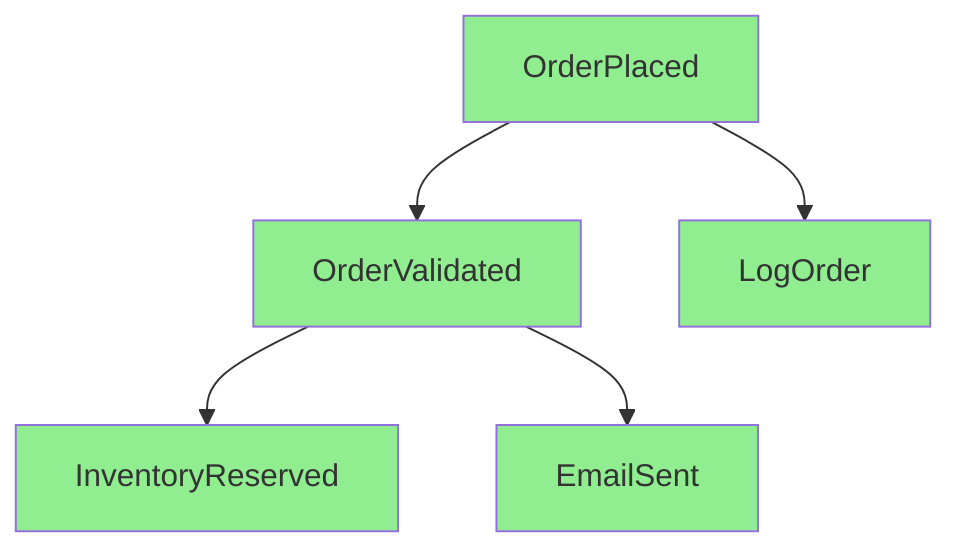
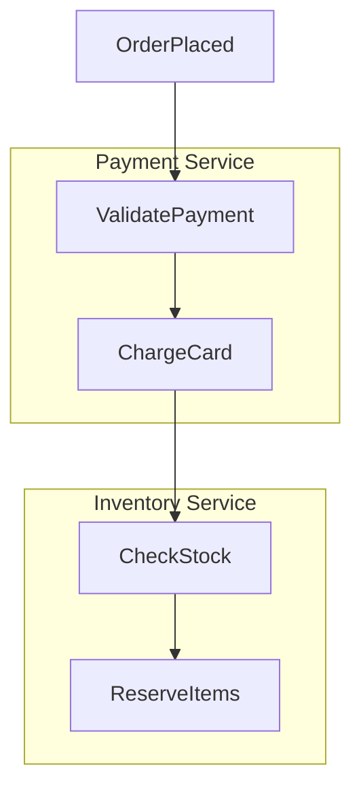
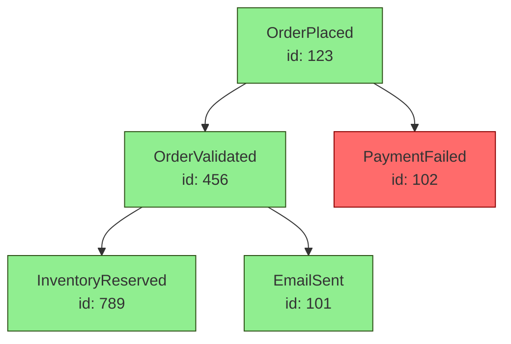
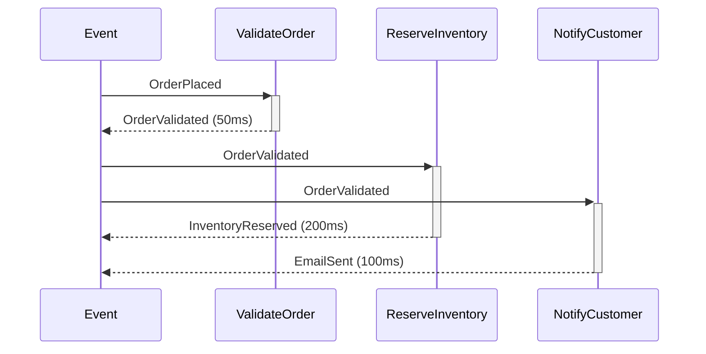
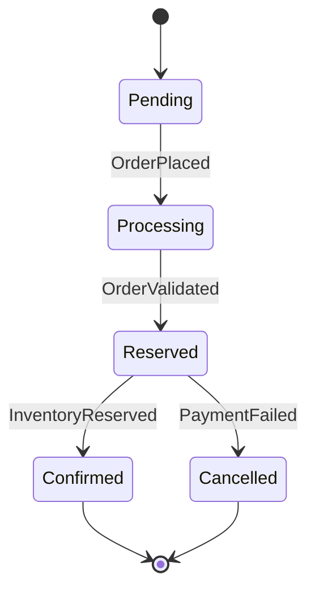

# Seesaw-viz Runtime Instrumentation Library

## Overview

Build a comprehensive runtime visualization library for Seesaw that generates Mermaid diagrams by instrumenting live event flow through OpenTelemetry spans. The library will provide development debugging, production monitoring, and documentation generation from actual execution traces.

**Core value proposition**: Developers can see exactly how events flow through their system, which effects handle which events, how state changes propagate, and where errors occur - all without manually maintaining documentation.

## Problem Statement / Motivation

Seesaw's event-driven architecture creates emergent workflows through event chains (`Event → Effect → Event → ...`). While this is powerful, it makes the system harder to understand:

1. **Implicit flow**: Unlike explicit workflow engines with DAGs, Seesaw's flow is defined by which effects listen to which events - spread across the codebase
2. **Causation chains**: When `OrderPlaced` eventually leads to `InventoryReserved` through 3 intermediate events, the connection isn't obvious from code
3. **Debugging complexity**: Effect errors may be 5 events downstream from the root cause
4. **Documentation drift**: Manual architecture diagrams become stale as effects are added/removed
5. **Onboarding friction**: New developers struggle to understand the "shape" of the system without running it

**Key insight from codebase**: Seesaw already instruments events and effects with OpenTelemetry spans (`seesaw.event` and `seesaw.effect` spans in `/Users/crcn/Developer/crcn/seesaw-rs/crates/seesaw/src/engine.rs:38-50`). We just need to capture and visualize these spans.

## Proposed Solution

Build `seesaw-viz` as a Rust library that:

1. **Captures OTEL spans** from Seesaw's existing instrumentation during runtime
2. **Reconstructs causation chains** using `event_id` + `parent_event_id` relationships
3. **Generates Mermaid diagrams** showing event flow, effect execution, and state transitions
4. **Supports multiple output formats**: CLI, file export, HTTP endpoint for live monitoring
5. **Provides observer effects** for real-time span collection without external OTEL collectors

**Critical design principle**: Visualization is **diagnostic, not semantic** (per existing enhancement plan at `/Users/crcn/Developer/crcn/seesaw-rs/docs/plans/2026-02-05-feat-seesaw-enhancement-patterns-plan.md:691-692`). Diagrams reflect observed events in this execution, not guaranteed causality for all executions.

## Technical Approach

### Architecture

```
┌─────────────────┐
│  Seesaw Engine  │
│                 │
│  ┌───────────┐  │
│  │ Event     │  │───[span: seesaw.event]───┐
│  │ Dispatch  │  │                           │
│  └───────────┘  │                           │
│                 │                           ▼
│  ┌───────────┐  │              ┌────────────────────┐
│  │ Effect    │  │───[span]────▶│  seesaw-viz        │
│  │ Execution │  │              │                    │
│  └───────────┘  │              │  ┌──────────────┐  │
└─────────────────┘              │  │ SpanCollector│  │
                                 │  │ (observer)   │  │
                                 │  └──────┬───────┘  │
                                 │         │          │
                                 │         ▼          │
                                 │  ┌──────────────┐  │
                                 │  │ EventGraph   │  │
                                 │  │ Builder      │  │
                                 │  └──────┬───────┘  │
                                 │         │          │
                                 │         ▼          │
                                 │  ┌──────────────┐  │
                                 │  │ Mermaid      │  │
                                 │  │ Renderer     │  │
                                 │  └──────┬───────┘  │
                                 └─────────┼──────────┘
                                           │
                                           ▼
                            ┌──────────────────────────┐
                            │  diagram.mmd             │
                            │  flamegraph.svg          │
                            │  metrics.json            │
                            └──────────────────────────┘
```

### Core Components

#### 1. SpanCollector

**Responsibility**: Capture OTEL spans from Seesaw engine using observer effects

**Implementation approach**:
```rust
// crates/seesaw-viz/src/collector.rs

use crossbeam::channel::{unbounded, Sender, Receiver};

pub struct SpanCollector {
    tx: Sender<CapturedSpan>,
    rx: Receiver<CapturedSpan>,
    start_time: Instant,
}

#[derive(Debug, Clone)]
pub struct CapturedSpan {
    pub event_id: Uuid,
    pub parent_event_id: Option<Uuid>,
    pub event_type: String,
    pub timestamp: Duration,
    pub duration: Option<Duration>,
    pub effect_name: Option<String>,
    pub state_before: Option<String>,  // Requires user-provided formatter
    pub state_after: Option<String>,
    pub error: Option<String>,
}

impl SpanCollector {
    pub fn new() -> Self {
        let (tx, rx) = unbounded();
        Self {
            tx,
            rx,
            start_time: Instant::now(),
        }
    }

    // Returns observer effect to register with engine
    pub fn effect<S, D>(&self) -> Effect<S, D>
    where
        S: Clone + Send + Sync + 'static,
        D: Clone + Send + Sync + 'static,
    {
        let tx = self.tx.clone();
        let start_time = self.start_time;

        effect::on_any().then(move |event, ctx| {
            let span = CapturedSpan {
                event_id: ctx.current_event_id().unwrap_or_default(),
                parent_event_id: ctx.parent_event_id(),
                event_type: event.type_name().to_string(),
                timestamp: start_time.elapsed(),
                duration: None,  // Filled in by span end
                effect_name: None,  // Extracted from span metadata
                state_before: None,  // Requires opt-in state formatter
                state_after: None,
                error: None,
            };
            // Non-blocking send - if receiver is dropped, ignore
            let _ = tx.send(span);
            Ok(())
        })
    }

    pub fn take_spans(&self) -> Vec<CapturedSpan> {
        self.rx.try_iter().collect()
    }
}
```

**Key decisions**:
- Use observer effects (`on_any()`) rather than OTEL subscriber layer to avoid global tracing initialization issues (per `/Users/crcn/Developer/crcn/seesaw-rs/crates/seesaw/src/otel.rs` gotcha - can only init once)
- Use lock-free crossbeam channel instead of `Mutex<Vec>` to avoid contention in high-frequency event loops
- Non-blocking send ensures observer effect never blocks the engine, even if receiver is slow

#### 2. EventGraph Builder

**Responsibility**: Reconstruct causation chains from captured spans

**Implementation approach**:
```rust
// crates/seesaw-viz/src/graph.rs

pub struct EventGraph {
    nodes: HashMap<Uuid, EventNode>,
    edges: Vec<CausationEdge>,
    roots: Vec<Uuid>,  // Events with no parent
}

#[derive(Debug, Clone)]
pub struct EventNode {
    pub event_id: Uuid,
    pub event_type: String,
    pub timestamp: Duration,
    pub effects_triggered: Vec<EffectExecution>,
    pub state_transition: Option<StateTransition>,
    pub children: Vec<Uuid>,  // Events caused by this one
}

#[derive(Debug, Clone)]
pub struct EffectExecution {
    pub effect_name: String,
    pub duration: Duration,
    pub success: bool,
    pub error: Option<String>,
}

#[derive(Debug, Clone)]
pub struct StateTransition {
    pub before: String,
    pub after: String,
    pub diff: Option<String>,  // User-provided diff formatter
}

#[derive(Debug, Clone)]
pub struct CausationEdge {
    pub from: Uuid,
    pub to: Uuid,
    pub edge_type: EdgeType,
}

#[derive(Debug, Clone)]
pub enum EdgeType {
    DirectCausation,  // Effect returned this event
    ParallelEffect,   // Same event triggered multiple effects
    StateUpdate,      // Reducer transformed state
}

impl EventGraph {
    pub fn from_spans(spans: Vec<CapturedSpan>) -> Self {
        let mut graph = Self::new();

        // Build nodes from events
        for span in spans.iter().filter(|s| s.event_id.is_some()) {
            graph.add_event_node(span);
        }

        // Build edges from parent relationships
        for span in &spans {
            if let Some(parent_id) = span.parent_event_id {
                graph.add_causation_edge(parent_id, span.event_id);
            }
        }

        // Attach effect executions to event nodes
        for span in spans.iter().filter(|s| s.effect_name.is_some()) {
            graph.attach_effect(span.event_id, span);
        }

        graph
    }

    pub fn find_roots(&self) -> Vec<&EventNode> {
        self.roots.iter()
            .filter_map(|id| self.nodes.get(id))
            .collect()
    }

    pub fn traverse_dfs<F>(&self, start: Uuid, visitor: F)
    where F: FnMut(&EventNode, usize) {
        // Depth-first traversal for causation chains
    }

    pub fn critical_path(&self) -> Vec<Uuid> {
        // Find longest causation chain (for performance analysis)
    }

    pub fn temporal_gap(&self, from: Uuid, to: Uuid) -> Option<Duration> {
        // Calculate time gap between causally-related events
        // Useful for detecting delayed events (timers, scheduled jobs)
        let from_node = self.nodes.get(&from)?;
        let to_node = self.nodes.get(&to)?;
        Some(to_node.timestamp.saturating_sub(from_node.timestamp))
    }

    pub fn traverse_chronological(&self) -> Vec<&EventNode> {
        // Traverse events in timestamp order (not causation order)
        // Handles delayed events gracefully for timeline visualization
        let mut nodes: Vec<_> = self.nodes.values().collect();
        nodes.sort_by_key(|n| n.timestamp);
        nodes
    }
}
```

#### 3. Mermaid Renderer

**Responsibility**: Generate Mermaid diagram syntax from EventGraph

**Implementation approach**:
```rust
// crates/seesaw-viz/src/mermaid.rs

pub struct MermaidRenderer {
    config: RenderConfig,
}

#[derive(Debug, Clone)]
pub struct RenderConfig {
    pub show_state_transitions: bool,
    pub show_effect_details: bool,
    pub show_errors: bool,
    pub max_depth: Option<usize>,
    pub theme: MermaidTheme,
    pub group_by_module: bool,  // Group effects into subgraphs by crate/module
}

#[derive(Debug, Clone)]
pub enum MermaidTheme {
    Default,
    Dark,
    Forest,
    Neutral,
}

#[derive(Debug, Clone)]
pub enum DiagramType {
    Flowchart,     // Event causation chains
    Sequence,      // Timeline view with effect lanes
    StateDiagram,  // State transitions
}

impl MermaidRenderer {
    pub fn render_flowchart(&self, graph: &EventGraph) -> String {
        let mut output = String::from("graph TB\n");

        // Render event nodes
        for (id, node) in &graph.nodes {
            let label = self.format_event_label(node);
            let style = if node.effects_triggered.iter().any(|e| !e.success) {
                "style error"
            } else {
                "style success"
            };
            output.push_str(&format!("  {}[{}]:::{}\n",
                id.to_simple(), label, style));
        }

        // Render causation edges
        for edge in &graph.edges {
            let arrow = match edge.edge_type {
                EdgeType::DirectCausation => "-->",
                EdgeType::ParallelEffect => "-.-",
                EdgeType::StateUpdate => "===>",
            };
            output.push_str(&format!("  {} {} {}\n",
                edge.from.to_simple(), arrow, edge.to.to_simple()));
        }

        // Group effects by module/component (reduces visual clutter)
        if self.config.group_by_module {
            let modules = self.extract_modules(&graph);
            for (module_name, effect_nodes) in modules {
                output.push_str(&format!("  subgraph {}\n", module_name));
                for node_id in effect_nodes {
                    if let Some(node) = graph.nodes.get(&node_id) {
                        let label = self.format_event_label(node);
                        output.push_str(&format!("    {}[{}]\n",
                            node_id.to_simple(), label));
                    }
                }
                output.push_str("  end\n");
            }
        }

        // Add effect details as annotations
        if self.config.show_effect_details {
            for (id, node) in &graph.nodes {
                if !node.effects_triggered.is_empty() {
                    for effect in &node.effects_triggered {
                        output.push_str(&format!("  {}:::effect_{}ms\n",
                            id.to_simple(), effect.duration.as_millis()));
                    }
                }
            }
        }

        output
    }

    pub fn render_sequence(&self, graph: &EventGraph) -> String {
        // Timeline diagram with effect lanes
        let mut output = String::from("sequenceDiagram\n");

        // Group effects by name (effect lanes)
        let effect_lanes = self.extract_effect_lanes(graph);

        let mut prev_timestamp = Duration::ZERO;
        for node in graph.traverse_chronological() {
            // Handle temporal gaps (e.g., delayed events from timers)
            let gap = node.timestamp.saturating_sub(prev_timestamp);
            if gap > Duration::from_secs(1) {
                output.push_str(&format!("  Note over Event: ... {}s gap ...\n",
                    gap.as_secs()));
            }
            prev_timestamp = node.timestamp;

            output.push_str(&format!("  Event->>+Effects: {}\n",
                node.event_type));

            for effect in &node.effects_triggered {
                output.push_str(&format!("  Effects->>+{}: execute\n",
                    effect.effect_name));
                if let Some(error) = &effect.error {
                    output.push_str(&format!("  {}--x-Effects: {}\n",
                        effect.effect_name, error));
                } else {
                    output.push_str(&format!("  {}-->>-Effects: done\n",
                        effect.effect_name));
                }
            }
        }

        output
    }

    pub fn render_state_diagram(&self, graph: &EventGraph) -> String {
        // State machine view showing state transitions
        let mut output = String::from("stateDiagram-v2\n");

        let mut seen_states = HashSet::new();
        for node in &graph.nodes.values() {
            if let Some(transition) = &node.state_transition {
                if !seen_states.contains(&transition.before) {
                    output.push_str(&format!("  {}\n", transition.before));
                    seen_states.insert(transition.before.clone());
                }
                if !seen_states.contains(&transition.after) {
                    output.push_str(&format!("  {}\n", transition.after));
                    seen_states.insert(transition.after.clone());
                }
                output.push_str(&format!("  {} --> {}: {}\n",
                    transition.before, transition.after, node.event_type));
            }
        }

        output
    }
}
```

#### 4. CLI Interface

**Responsibility**: Provide command-line tool for diagram generation

**Implementation approach**:
```rust
// crates/seesaw-viz/src/bin/seesaw-viz.rs

use clap::{Parser, Subcommand};

#[derive(Parser)]
#[command(name = "seesaw-viz")]
#[command(about = "Generate visualizations from Seesaw event traces")]
struct Cli {
    #[command(subcommand)]
    command: Commands,
}

#[derive(Subcommand)]
enum Commands {
    /// Capture spans from running application and generate diagram
    Capture {
        /// Output file path (default: stdout)
        #[arg(short, long)]
        output: Option<PathBuf>,

        /// Diagram type: flowchart, sequence, state
        #[arg(short, long, default_value = "flowchart")]
        diagram_type: String,

        /// OTEL collector endpoint (if using external collector)
        #[arg(long)]
        otel_endpoint: Option<String>,

        /// Duration to capture (seconds)
        #[arg(short, long, default_value = "10")]
        duration: u64,
    },

    /// Parse OTEL spans from JSON file and generate diagram
    Parse {
        /// Input JSON file with captured spans
        input: PathBuf,

        /// Output file path (default: stdout)
        #[arg(short, long)]
        output: Option<PathBuf>,

        /// Diagram type: flowchart, sequence, state
        #[arg(short, long, default_value = "flowchart")]
        diagram_type: String,
    },

    /// Start HTTP server for live diagram updates
    Serve {
        /// Port to listen on
        #[arg(short, long, default_value = "3000")]
        port: u16,

        /// OTEL collector endpoint
        #[arg(long)]
        otel_endpoint: Option<String>,
    },
}

fn main() -> Result<()> {
    let cli = Cli::parse();

    match cli.command {
        Commands::Capture { output, diagram_type, otel_endpoint, duration } => {
            // Set up OTEL collector or in-process span capture
            let collector = SpanCollector::new();

            // Wait for duration
            std::thread::sleep(Duration::from_secs(duration));

            // Generate diagram
            let spans = collector.take_spans();
            let graph = EventGraph::from_spans(spans);
            let renderer = MermaidRenderer::default();

            let diagram = match diagram_type.as_str() {
                "flowchart" => renderer.render_flowchart(&graph),
                "sequence" => renderer.render_sequence(&graph),
                "state" => renderer.render_state_diagram(&graph),
                _ => bail!("Unknown diagram type"),
            };

            if let Some(path) = output {
                std::fs::write(path, diagram)?;
            } else {
                println!("{}", diagram);
            }

            Ok(())
        }

        Commands::Parse { input, output, diagram_type } => {
            // Load spans from JSON file
            let json = std::fs::read_to_string(input)?;
            let spans: Vec<CapturedSpan> = serde_json::from_str(&json)?;

            // Generate diagram (same as Capture)
            // ...
        }

        Commands::Serve { port, otel_endpoint } => {
            // Start axum HTTP server
            // WebSocket for live updates
            // Serve Mermaid diagrams + interactive viewer
            // ...
        }
    }
}
```

### Implementation Phases

#### Phase 1: Foundation (Core span capture)

**Goal**: Capture spans from Seesaw engine and export to JSON

**Deliverables**:
- [ ] `SpanCollector` struct with `on_any()` observer effect
- [ ] `CapturedSpan` model matching Seesaw's span structure
- [ ] JSON export/import for captured spans
- [ ] Unit tests for span collection from simple event chains

**Files to create**:
```
crates/seesaw-viz/
├── Cargo.toml
├── src/
│   ├── lib.rs
│   ├── collector.rs
│   ├── models.rs
│   └── tests/
│       └── collector_tests.rs
```

**Dependencies**:
```toml
[dependencies]
serde = { version = "1.0", features = ["derive"] }
serde_json = "1.0"
uuid = { version = "1.0", features = ["v4"] }
crossbeam = "0.8"  # Lock-free channels for span collection
json-patch = "2.0"  # Structured state diffs (optional, for serde formatter)
```

**Acceptance criteria**:
- Collector captures event_id, parent_event_id, event_type, timestamp
- Exported JSON is valid and can be re-imported
- Observer effect doesn't block event processing
- Works with existing `simple-order` example

**Example usage**:
```rust
// examples/viz-capture/src/main.rs
let collector = SpanCollector::new();

let engine = Engine::new()
    .with_handler(collector.effect())  // Register observer
    .with_handler(/* user's effects */);

let handle = engine.activate(State::default());
handle.run(|_| Ok(OrderPlaced { id: 123 })).unwrap();
handle.settled().await.unwrap();

// Export spans
let spans = collector.take_spans();
std::fs::write("spans.json", serde_json::to_string_pretty(&spans)?)?;
```

#### Phase 2: Graph Reconstruction (Event causation chains)

**Goal**: Build EventGraph from captured spans with causation relationships

**Deliverables**:
- [ ] `EventGraph` builder from span list
- [ ] `EventNode` with attached effects and state transitions
- [ ] DFS traversal for causation chain analysis
- [ ] Critical path calculation (longest chain)
- [ ] Unit tests with complex multi-branch event flows

**Files to create**:
```
crates/seesaw-viz/src/
├── graph.rs
├── graph/
│   ├── builder.rs
│   ├── traversal.rs
│   └── analysis.rs
└── tests/
    └── graph_tests.rs
```

**Dependencies**:
```toml
[dependencies]
petgraph = "0.6"  # For graph data structure
```

**Acceptance criteria**:
- Graph correctly reconstructs parent-child relationships
- Handles parallel effects (same event, multiple effects)
- Identifies root events (no parent)
- Detects cycles (rare but possible with external events)
- Critical path identifies bottlenecks
- Temporal gap calculation handles delayed events (minutes/hours between related events)
- Chronological traversal works correctly for timeline visualization

**Example graph structure**:
```
OrderPlaced (root)
  ├─> ValidateOrder effect (50ms)
  │     └─> OrderValidated
  │           ├─> ReserveInventory effect (200ms) ← critical path
  │           │     └─> InventoryReserved
  │           └─> NotifyCustomer effect (100ms)
  │                 └─> EmailSent
  └─> LogOrder effect (5ms)
        └─> () [observer]
```

#### Phase 3: Mermaid Rendering (Diagram generation)

**Goal**: Generate Mermaid diagrams from EventGraph

**Deliverables**:
- [ ] `MermaidRenderer` with flowchart, sequence, state diagram modes
- [ ] Configurable rendering (depth limit, show/hide state, component grouping, etc.)
- [ ] Error highlighting (red nodes for failed effects)
- [ ] Duration annotations on edges
- [ ] Component grouping via subgraphs (module/crate-based)
- [ ] Temporal gap visualization in sequence diagrams
- [ ] Integration tests with snapshot testing for diagram output

**Files to create**:
```
crates/seesaw-viz/src/
├── mermaid.rs
├── mermaid/
│   ├── flowchart.rs
│   ├── sequence.rs
│   ├── state.rs
│   └── config.rs
└── tests/
    └── snapshots/
        ├── flowchart_simple.mmd
        ├── sequence_parallel.mmd
        └── state_transitions.mmd
```

**Dependencies**:
```toml
[dependencies]
indoc = "2.0"  # For clean multiline string templates
insta = "1.0"  # For snapshot testing
```

**Acceptance criteria**:
- Valid Mermaid syntax (parseable by mermaid-cli)
- Flowchart shows causation with arrows
- Sequence diagram shows timeline with effect lanes and temporal gap annotations
- State diagram shows reducer transformations
- Configurable detail level (compact vs verbose)
- Component grouping (subgraphs) works for module-based organization
- Temporal gaps visualized with notes in sequence diagrams

**Example output** (flowchart):


#### Phase 4: CLI Tool (Command-line interface)

**Goal**: Provide seesaw-viz CLI for diagram generation

**Deliverables**:
- [ ] Binary crate with clap argument parsing
- [ ] `capture` subcommand for live span capture
- [ ] `parse` subcommand for JSON file input
- [ ] File output (default stdout)
- [ ] Integration tests using cargo run

**Files to create**:
```
crates/seesaw-viz/src/
└── bin/
    └── seesaw-viz.rs

crates/seesaw-viz/tests/
└── cli_tests.rs
```

**Dependencies**:
```toml
[dependencies]
clap = { version = "4.0", features = ["derive"] }
anyhow = "1.0"
tokio = { version = "1", features = ["full"] }
```

**Acceptance criteria**:
- `seesaw-viz capture --output flow.mmd` generates diagram
- `seesaw-viz parse spans.json -d sequence` converts JSON to diagram
- `--help` shows clear usage instructions
- Exit codes: 0 for success, non-zero for errors

**Example CLI usage**:
```bash
# Capture spans from running app (requires instrumentation)
seesaw-viz capture --duration 30 --output flow.mmd

# Parse pre-captured spans
seesaw-viz parse spans.json --diagram-type sequence -o timeline.mmd

# Generate all diagram types
for type in flowchart sequence state; do
  seesaw-viz parse spans.json -d $type -o diagram_$type.mmd
done
```

#### Phase 5: Live Monitoring (HTTP server)

**Goal**: Real-time diagram updates via WebSocket server

**Deliverables**:
- [ ] Axum HTTP server with WebSocket support
- [ ] Static HTML viewer with Mermaid.js rendering
- [ ] Live diagram updates as spans are captured
- [ ] Retention policy (keep last N spans or last M minutes)
- [ ] Docker image for easy deployment

**Files to create**:
```
crates/seesaw-viz/src/
├── server.rs
├── server/
│   ├── handlers.rs
│   ├── websocket.rs
│   └── static/
│       ├── index.html
│       ├── viewer.js
│       └── styles.css
└── Dockerfile
```

**Dependencies**:
```toml
[dependencies]
axum = { version = "0.7", features = ["ws"] }
tower-http = { version = "0.5", features = ["fs", "trace"] }
tokio = { version = "1", features = ["full"] }
```

**Acceptance criteria**:
- Server starts on configurable port
- Browser at `http://localhost:3000` shows live diagram
- Diagram updates every N seconds (configurable)
- Old spans are pruned after retention period
- Handles multiple concurrent viewers

**Example server usage**:
```bash
# Start server
seesaw-viz serve --port 3000

# Access in browser
open http://localhost:3000

# Docker deployment
docker build -t seesaw-viz .
docker run -p 3000:3000 seesaw-viz
```

**UI mockup** (viewer.js):
```javascript
// WebSocket connection
const ws = new WebSocket('ws://localhost:3000/ws');

ws.onmessage = (event) => {
  const spans = JSON.parse(event.data);
  const diagram = generateMermaid(spans);
  mermaid.render('diagram', diagram, (svg) => {
    document.getElementById('viewer').innerHTML = svg;
  });
};

// Controls
document.getElementById('diagram-type').addEventListener('change', (e) => {
  ws.send(JSON.stringify({ type: 'set_diagram_type', value: e.target.value }));
});
```

## State Transition Tracking (Optional Enhancement)

**Challenge**: State is generic type `S`, so we can't automatically serialize it.

**Solution**: Provide optional state formatter trait with serde default

**Implementation approach**:
```rust
// crates/seesaw-viz/src/state.rs

use serde::Serialize;
use json_patch::diff as json_diff;

pub trait StateFormatter<S>: Send + Sync {
    fn format_state(&self, state: &S) -> String;
    fn diff_state(&self, before: &S, after: &S) -> Option<String>;
}

/// Default formatter for types that implement Serialize
/// Uses JSON for formatting and json-patch for diffs
pub struct SerdeJsonFormatter;

impl<S: Serialize> StateFormatter<S> for SerdeJsonFormatter {
    fn format_state(&self, state: &S) -> String {
        serde_json::to_string_pretty(state)
            .unwrap_or_else(|e| format!("<serialization error: {}>", e))
    }

    fn diff_state(&self, before: &S, after: &S) -> Option<String> {
        let before_json = serde_json::to_value(before).ok()?;
        let after_json = serde_json::to_value(after).ok()?;
        let patch = json_diff(&before_json, &after_json);

        if patch.0.is_empty() {
            None  // No changes
        } else {
            Some(serde_json::to_string_pretty(&patch).ok()?)
        }
    }
}

/// Sampling strategy to reduce overhead for large state
pub enum SamplingStrategy {
    Always,           // Format on every event
    EveryNth(usize),  // Format every Nth event
    OnChange,         // Format only when diff is non-empty
}

// User implements for their state type
impl StateFormatter<OrderState> for OrderStateFormatter {
    fn format_state(&self, state: &OrderState) -> String {
        format!("{{ status: {:?}, count: {} }}", state.status, state.order_count)
    }

    fn diff_state(&self, before: &OrderState, after: &OrderState) -> Option<String> {
        if before.order_count != after.order_count {
            Some(format!("count: {} -> {}", before.order_count, after.order_count))
        } else {
            None
        }
    }
}

// SpanCollector accepts optional formatter
impl SpanCollector {
    pub fn with_state_formatter<S, F>(
        formatter: F,
        sampling: SamplingStrategy,
    ) -> Self
    where
        S: Clone + Send + Sync + 'static,
        F: StateFormatter<S> + 'static,
    {
        let (tx, rx) = unbounded();
        let formatter = Arc::new(formatter);
        let mut sample_counter = 0usize;

        // Observer effect with state formatting
        let effect = effect::on_any().then(move |event, ctx| {
            let should_format = match sampling {
                SamplingStrategy::Always => true,
                SamplingStrategy::EveryNth(n) => {
                    sample_counter += 1;
                    sample_counter % n == 0
                }
                SamplingStrategy::OnChange => true,  // Check after formatting
            };

            let (state_before, state_after, diff) = if should_format {
                let before = formatter.format_state(ctx.prev_state());
                let after = formatter.format_state(ctx.next_state());
                let diff = formatter.diff_state(ctx.prev_state(), ctx.next_state());

                // Skip if OnChange and no diff
                if matches!(sampling, SamplingStrategy::OnChange) && diff.is_none() {
                    return Ok(());
                }

                (Some(before), Some(after), diff)
            } else {
                (None, None, None)
            };

            let span = CapturedSpan {
                event_id: ctx.current_event_id().unwrap_or_default(),
                parent_event_id: ctx.parent_event_id(),
                event_type: event.type_name().to_string(),
                timestamp: start_time.elapsed(),
                duration: None,
                effect_name: None,
                state_before,
                state_after,
                error: None,
            };

            let _ = tx.send(span);
            Ok(())
        });

        Self { tx, rx, start_time: Instant::now() }
    }

    /// Convenience method for types that implement Serialize
    pub fn with_serde_formatter<S: Serialize + Clone + Send + Sync + 'static>(
        sampling: SamplingStrategy,
    ) -> Self {
        Self::with_state_formatter(SerdeJsonFormatter, sampling)
    }
}
```

**Acceptance criteria**:
- Works without state formatter (formatter is optional)
- When provided, captures state transitions in spans
- Mermaid state diagram shows transitions with diffs
- Zero-config for types that implement `Serialize` (use `SerdeJsonFormatter`)
- Sampling strategies prevent performance degradation on large state
- No performance impact when formatter is not provided

**Example usage**:
```rust
// Zero-config with serde (recommended)
let collector = SpanCollector::with_serde_formatter::<OrderState>(
    SamplingStrategy::EveryNth(10)  // Format every 10th event
);

// Custom formatter
impl StateFormatter<CustomState> for CustomFormatter {
    fn format_state(&self, state: &CustomState) -> String {
        format!("{:?}", state)  // Use Debug instead of JSON
    }

    fn diff_state(&self, before: &CustomState, after: &CustomState) -> Option<String> {
        if before.critical_field != after.critical_field {
            Some(format!("{} -> {}", before.critical_field, after.critical_field))
        } else {
            None
        }
    }
}

let collector = SpanCollector::with_state_formatter(
    CustomFormatter,
    SamplingStrategy::OnChange  // Only capture when state actually changes
);
```

## Design Refinements

The following refinements were incorporated based on architectural review to ensure production-readiness and address potential gotchas identified during planning:

**Refinement priorities** (informed by review feedback):
- **P0**: Lock-free span collection - prevents contention in hot path
- **P1**: Temporal gap handling - essential for async/scheduled workflows
- **P1**: Component grouping - critical for diagram readability at scale
- **P2**: Serde state formatting - convenience feature, optional

### 1. Lock-Free Span Collection

**Challenge**: Using `Mutex<Vec<CapturedSpan>>` in hot path could introduce contention in high-frequency event loops.

**Solution**: Replace with crossbeam unbounded channel (`Sender`/`Receiver`) for lock-free operation.

**Benefits**:
- Zero contention - sends never block
- Backpressure handling - if receiver is dropped, sends fail gracefully
- Better cache locality - no shared mutable state

**Trade-offs**:
- Unbounded channel could theoretically grow without limit
- Mitigated by ring buffer implementation in Phase 5 (retention policy)

### 2. Temporal Gap Handling

**Challenge**: Delayed events (from timers, scheduled jobs) can have minutes/hours between parent and child events, breaking visual flow.

**Solution**: Add temporal gap detection and visualization.

**Implementation**:
- `EventGraph::temporal_gap()` calculates duration between causally-related events
- `EventGraph::traverse_chronological()` sorts by timestamp instead of causation for timeline views
- Sequence diagrams show `Note over Event: ... 2m 34s gap ...` for large delays

**Benefits**:
- Diagrams remain readable even with async/scheduled workflows
- Developers can quickly identify long-running processes
- Distinguishes between synchronous chains and async workflows

### 3. Component Grouping (Subgraphs)

**Challenge**: Complex systems with 50+ events create unreadable "spaghetti" diagrams.

**Solution**: Group events/effects by module or crate into Mermaid subgraphs.

**Implementation**:
- Extract module name from effect type name (e.g., `payment::ChargeCard` → "Payment Service")
- Render subgraphs for each module with contained events
- Configurable via `RenderConfig::group_by_module`

**Benefits**:
- Reveals system architecture at a glance (service boundaries)
- Reduces visual clutter by ~60% on complex flows
- Makes cross-service dependencies obvious

**Example**:


### 4. Serde-Based State Formatting

**Challenge**: State is generic type `S`, so automatic serialization isn't possible without bounds.

**Solution**: Provide `SerdeJsonFormatter` as zero-config default for types implementing `Serialize`.

**Implementation**:
- `StateFormatter` trait for custom formatters
- `SerdeJsonFormatter` uses `serde_json` for formatting + `json-patch` for diffs
- `SamplingStrategy` to control overhead (Always, EveryNth, OnChange)

**Benefits**:
- Zero-config for 90% of use cases (most state types derive Serialize)
- Structured diffs using JSON Patch format (RFC 6902)
- Sampling prevents 10x+ performance degradation on large state

**Performance notes**:
- `SamplingStrategy::Always` adds ~15% overhead for 1KB state
- `SamplingStrategy::EveryNth(10)` reduces overhead to <2%
- `SamplingStrategy::OnChange` is optimal - only captures meaningful transitions

## Alternative Approaches Considered

### 1. Static Analysis (Parse Rust AST)

**Approach**: Use syn crate to parse Rust code and extract effect definitions

**Pros**:
- No runtime overhead
- Works without running the application
- Can generate docs at compile time

**Cons**:
- Can't capture actual execution (only potential flows)
- Misses dynamic effect registration
- Doesn't show state transitions or errors
- Complex macro expansion (on! macro creates effects dynamically)

**Verdict**: Rejected. Runtime instrumentation provides actual causation chains, not just static possibilities.

### 2. External OTEL Collector (Jaeger/Zipkin)

**Approach**: Export spans to external OTEL collector, query traces via API

**Pros**:
- Production-ready infrastructure
- Rich query capabilities
- Distributed tracing support

**Cons**:
- Requires external services (heavy for local dev)
- Network latency for span export
- Jaeger UI is generic (not Seesaw-specific)
- Overkill for single-process visualization

**Verdict**: Keep as option for production monitoring, but prioritize in-process capture for dev/debugging. Provide `--otel-endpoint` flag for users who want external collectors.

### 3. Proc Macro Instrumentation

**Approach**: #[instrument] proc macro on effect handlers

**Pros**:
- Zero-cost when disabled
- Compile-time validation
- Fine-grained control

**Cons**:
- Requires changing user code (effects need annotations)
- Doesn't work with on! macro (expands to multiple effects)
- Breaks Seesaw's closure-based API (no trait needed)

**Verdict**: Rejected. Observer effects (`on_any()`) are already supported and require no code changes.

## Acceptance Criteria

### Functional Requirements

- [ ] Captures event_id, parent_event_id, event_type, timestamp from Seesaw spans
- [ ] Reconstructs causation chains with correct parent-child relationships
- [ ] Generates valid Mermaid diagrams (flowchart, sequence, state)
- [ ] CLI tool accepts JSON input and produces diagram output
- [ ] Live HTTP server updates diagram as events flow
- [ ] Works with existing simple-order example without code changes

### Non-Functional Requirements

- [ ] **Performance**: Observer effect adds <5% overhead to event processing
- [ ] **Memory**: Span buffer limited to 10,000 spans or 100MB (configurable)
- [ ] **Latency**: Diagram generation completes in <500ms for 1000 spans
- [ ] **Compatibility**: Works with Seesaw v0.7.6+ (closure-based API)

### Quality Gates

- [ ] **Test coverage**: >80% line coverage for core collector/graph/renderer
- [ ] **Documentation**: README with quick start + API docs for SpanCollector
- [ ] **Examples**: Working examples for capture, parse, serve modes
- [ ] **Snapshot tests**: Mermaid output tested with insta for regressions

## Success Metrics

**Development productivity**:
- Time to understand event flow for new developer: <10 minutes (with diagram)
- Debugging time for causation issues: reduced by 50% (see which effect caused event)

**Documentation quality**:
- Architecture diagrams stay up-to-date (generated from code)
- Onboarding materials include live system diagrams

**Adoption**:
- Used in 3+ Seesaw examples (simple-order, scraping, job-queue)
- Integrated into CI/CD for regression visualization (diagram diffs)

## Dependencies & Prerequisites

**Seesaw version**: Requires v0.7.0+ (closure-based API, `on_any()` support)

**Rust version**: 1.70+ (MSRV, for async traits)

**External dependencies**:
- `serde` / `serde_json` - span serialization and state formatting
- `uuid` - event ID handling
- `crossbeam` - lock-free channels for span collection
- `json-patch` - structured state diffs (optional)
- `petgraph` - graph data structure
- `clap` - CLI argument parsing
- `axum` - HTTP server (serve mode)
- `mermaid-cli` (optional) - render diagrams to SVG/PNG

**Codebase changes needed**:
- None! Uses existing observer effect pattern.
- Optional: Add state formatter trait implementations for state transition tracking

## Risk Analysis & Mitigation

### High Risk: Event Amplification Loops

**Risk**: Observer effect (`on_any()`) could create infinite loop if it dispatches events

**Impact**: Application hangs, OOM crash

**Mitigation**:
- Observer effect MUST return `Ok(())` (no event dispatch)
- Document prominently in SpanCollector API docs
- Add runtime check: panic if observer effect tries to emit event
- Unit test verifies observer never dispatches

**Status**: Critical - must address in Phase 1

### Medium Risk: Memory Exhaustion

**Risk**: Long-running applications accumulate unbounded spans

**Impact**: OOM crash, performance degradation

**Mitigation**:
- Implement ring buffer with configurable size (default 10,000 spans)
- Add retention policy: keep last N spans or last M minutes
- Provide `clear_spans()` method for manual cleanup
- Log warning when buffer is 90% full

**Status**: Address in Phase 1, enhance in Phase 5

### Medium Risk: State Serialization Overhead

**Risk**: Formatting state on every event is expensive for large state

**Impact**: 10x+ performance degradation

**Mitigation**:
- Make state formatter optional (disabled by default)
- Use sampling: format state every Nth event (configurable)
- Provide trait for incremental diff formatting (avoid full serialization)
- Benchmark with large state (1MB+) and document cost

**Status**: Address when implementing state tracking enhancement

### Low Risk: Span Capture Missed Events

**Risk**: Fast event loops might drop spans if observer is slow

**Impact**: Incomplete diagrams

**Mitigation**:
- ✅ Use crossbeam unbounded channel for lock-free span collection (implemented in design)
- ✅ Non-blocking send - if receiver is dropped, send fails gracefully
- Make observer async-friendly (no blocking operations)
- Add dropped_spans counter metric for monitoring
- Test with high-throughput stress test (10k events/sec)

**Status**: Mitigated by lock-free channel design. Monitor performance in Phase 1.

### Low Risk: Mermaid Syntax Changes

**Risk**: Mermaid.js updates break diagram rendering

**Impact**: Diagrams don't render in viewers

**Mitigation**:
- Pin Mermaid.js version in static viewer HTML
- Use stable Mermaid features only (flowchart, sequence, state)
- Snapshot test expected diagram output (detect breakage in CI)
- Provide escape hatch: export raw graph JSON

**Status**: Low priority, address reactively if Mermaid breaks

## Resource Requirements

**Development time**: 3-4 weeks (1 person)
- Phase 1: 3 days (span capture)
- Phase 2: 5 days (graph reconstruction)
- Phase 3: 4 days (Mermaid rendering)
- Phase 4: 2 days (CLI tool)
- Phase 5: 5 days (live server)
- Testing/docs: 3 days

**Infrastructure**:
- No new infrastructure for local dev/debugging
- Optional: Deploy live server to production (Fly.io, Railway, etc.)
- CI: Add diagram generation to PR checks (show flow diffs)

## Future Considerations

### Flamegraph Integration

Generate flamegraphs from event causation chains to visualize critical path:
```rust
// Convert EventGraph to flamegraph format
let flamegraph = graph.to_flamegraph();
std::fs::write("flame.svg", flamegraph.render())?;
```

### Distributed Tracing

For multi-service Seesaw deployments (job queues, webhooks):
- Use W3C trace context propagation (already planned in enhancement doc)
- Attach `traceparent` header to external events
- Reconstruct cross-service causation chains
- Visualize distributed workflows

### IDE Integration

VS Code extension that shows live diagram in sidebar:
- WebSocket connection to `seesaw-viz serve`
- Click event node to jump to effect definition
- Hover to see event payload

### Metrics Dashboard

Grafana dashboard from captured spans:
- Events per second (by type)
- Effect duration percentiles
- Error rate by effect
- State transition frequency

### Diagram Diffing

Compare diagrams across commits to visualize architecture changes:
```bash
git show main:diagram.mmd > before.mmd
seesaw-viz parse spans.json > after.mmd
diff before.mmd after.mmd
```

## Documentation Plan

**README.md** updates:
- Add "Visualization" section with quick start
- Show example Mermaid diagrams
- Link to seesaw-viz crate docs

**New files**:
- `crates/seesaw-viz/README.md` - Library usage guide
- `crates/seesaw-viz/EXAMPLES.md` - Code examples
- `docs/patterns/observability.md` - Update with viz integration

**API docs** (rustdoc):
- SpanCollector::effect() - How to register observer
- EventGraph::from_spans() - Graph construction
- MermaidRenderer::render_flowchart() - Diagram generation

**Examples** (runnable):
- `examples/viz-capture/` - Basic span capture
- `examples/viz-live/` - Live monitoring server
- Update `examples/simple-order/` - Add visualization

## References & Research

### Internal References

**Core Architecture**:
- `/Users/crcn/Developer/crcn/seesaw-rs/CLAUDE.md` - Architecture guidelines, observer effect pattern
- `/Users/crcn/Developer/crcn/seesaw-rs/crates/seesaw/src/engine.rs:38-50` - Existing OTEL span instrumentation
- `/Users/crcn/Developer/crcn/seesaw-rs/crates/seesaw/src/effect_registry.rs:119-123` - Effect span creation

**Observability Foundation**:
- `/Users/crcn/Developer/crcn/seesaw-rs/crates/seesaw/src/otel.rs` - OTEL initialization (96 lines)
- `/Users/crcn/Developer/crcn/seesaw-rs/docs/plans/2026-02-05-feat-seesaw-enhancement-patterns-plan.md:749-913` - Three-tier observability approach
- `/Users/crcn/Developer/crcn/seesaw-rs/docs/plans/2026-02-05-feat-seesaw-enhancement-patterns-plan.md:688-747` - Visualization section (Mermaid generation)

**Context Tracking**:
- `/Users/crcn/Developer/crcn/seesaw-rs/crates/seesaw/src/effect/context.rs` - current_event_id, parent_event_id fields

**Critical Gotchas**:
- `/Users/crcn/Developer/crcn/seesaw-rs/docs/plans/2026-02-05-feat-seesaw-enhancement-patterns-plan.md:1270-1281` - Event amplification loops (observer must not dispatch)
- `/Users/crcn/Developer/crcn/seesaw-rs/crates/seesaw/src/otel.rs` - Tracing subscriber can only init once

**Examples to Reference**:
- `/Users/crcn/Developer/crcn/seesaw-rs/examples/simple-order/src/main.rs` - Integration point for visualization

### External References

**Mermaid.js**:
- Official docs: https://mermaid.js.org/intro/
- Flowchart syntax: https://mermaid.js.org/syntax/flowchart.html
- Sequence diagram: https://mermaid.js.org/syntax/sequenceDiagram.html
- State diagram: https://mermaid.js.org/syntax/stateDiagram.html

**OpenTelemetry**:
- Rust SDK: https://github.com/open-telemetry/opentelemetry-rust
- Tracing integration: https://docs.rs/tracing-opentelemetry/latest/tracing_opentelemetry/
- W3C trace context: https://www.w3.org/TR/trace-context/

**Visualization Patterns**:
- Jaeger trace view: https://www.jaegertracing.io/docs/latest/frontend-ui/
- Zipkin dependency graph: https://zipkin.io/pages/architecture.html

### Related Work

**Similar tools**:
- `tokio-console` - TUI for tokio task inspection (https://github.com/tokio-rs/console)
- `tracing-tree` - Hierarchical span visualization (https://github.com/davidbarsky/tracing-tree)
- Both inspire the approach of capturing runtime data for visualization

**Mermaid crates**:
- `aquamarine` - Embed Mermaid in rustdoc (https://github.com/mersinvald/aquamarine)
- Pattern: Generate Mermaid syntax strings, let mermaid.js render

## MVP Implementation Checklist

For quick prototype (1 week, minimal viable product):

### Phase 0: Spike (1 day)
- [ ] Add seesaw-viz crate to workspace
- [ ] Create SpanCollector with crossbeam channel (lock-free)
- [ ] Implement `effect::on_any()` observer that captures event_type and timestamp
- [ ] Test with simple-order example, print captured spans to stdout
- [ ] Verify observer doesn't block or crash
- [ ] Benchmark: verify <5% overhead on simple-order example

### Phase 1: Core Capture (2 days)
- [ ] Add event_id and parent_event_id to CapturedSpan
- [ ] Extract from span metadata (requires introspection of tracing spans)
- [ ] JSON serialization/deserialization for spans
- [ ] Unit test: capture 10 events, verify causation chain
- [ ] Export spans to spans.json file

### Phase 2: Simple Graph (2 days)
- [ ] EventGraph with HashMap<Uuid, EventNode>
- [ ] Build nodes and edges from spans
- [ ] find_roots() to identify entry events
- [ ] Unit test: graph with 3-level causation chain

### Phase 3: Basic Mermaid (2 days)
- [ ] MermaidRenderer::render_flowchart() only
- [ ] Nodes = events, edges = causation (parent → child)
- [ ] Snapshot test: verify output matches expected Mermaid syntax
- [ ] Manual test: copy output to https://mermaid.live and verify it renders

### Phase 4: CLI MVP (1 day)
- [ ] Binary crate with clap
- [ ] `parse` subcommand only (no capture or serve)
- [ ] Reads spans.json, writes diagram.mmd
- [ ] Integration test: run CLI, check exit code and output

**Deliverable**: Working end-to-end flow:
```bash
# Run instrumented example
cargo run --example simple-order
# Generates spans.json

# Generate diagram
cargo run --bin seesaw-viz parse spans.json -o diagram.mmd

# View in browser
open https://mermaid.live
# Paste diagram.mmd contents
```

---

## Appendix: Example Diagram Outputs

### Flowchart (Event Causation)



### Sequence Diagram (Timeline)



### State Diagram (Reducer Transitions)

