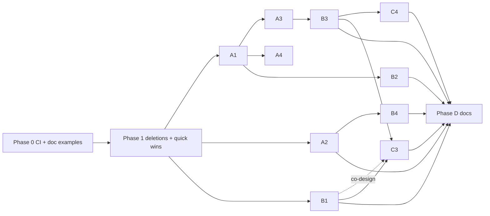

# 0.7.4 audit remediation — production readiness

**Date:** 2026-06-10
**Status:** Planned, rev 2 — pressure-tested by a three-reviewer panel
(DHH-style / Kieran-style / simplicity); A2 redesigned (revision-gated folds,
no schema change), B3 hardened (scan-then-CAS), phases resequenced. Nothing
landed.
**Author:** craig + Claude
**Inputs:** four-agent code/docs audit (this session), KurrentDB fact-check
against docs.kurrent.io + `kurrentdb` 1.2, SpecFlow gap analysis, usage audit
of the one real consumer (rootsignal: hybrid Kurrent + Pg, 34 reactors,
38 emit sites, `.settled()` on hot paths), and the rev-1 review panel.

## Overview

The audit confirmed the core design is sound (at-least-once + deterministic
event-id dedup, correlation-scoped settle, typed `ConflictError`, conformance
philosophy) and the Kurrent vocabulary alignment is real — but found two
data-integrity bugs, contract divergences between backends, a large
exported-but-dead API surface, stale docs.rs front pages, and no CI. This plan
fixes them in dependency order. **Nothing has shipped** (rootsignal migration
059: "the event store carries no production data"), so breaking changes are
free *now* and expensive later.

## Decisions

1. **Reactor outputs move from `StreamState::Any` to scan-then-CAS appends.**
   Kurrent's `Any`-append dedup is explicitly best-effort (docs +
   kurrent-io/KurrentDB#1970). CAS alone is NOT sufficient (rev-2 correction):
   after a crash-before-checkpoint the re-read head *includes* the orphaned
   outputs, so a CAS at the new head succeeds and duplicates. The design is a
   pre-append dedup scan made race-free by CAS — see B3.
2. **Unship `Upcaster`/`UpcasterRegistry` and the projection-ops surface**
   (`ProjectionMode`, `RetryPolicy`, `Backoff`, `FailureBehavior`,
   `ProjectionOps`). Exported, wired to nothing; rootsignal has zero hits.
   Upcasting is read-side — re-adding later needs no storage migration.
   `StartPosition` survives, reactor-only (B2).
3. **Keep `{CATEGORY}:{EventName}` event types; relabel as deliberate
   divergence.** Verified NOT a Kurrent convention, but the category namespace
   prevents cross-category `$et-` collisions and routing depends on it. The
   README vocab table moves this row into the "deliberate divergence" list.
   B1 consolidates the format into one module so the convention has a single
   owner.
4. **Fold idempotency keys on per-stream `StreamRevision`, not a global
   `LogCursor` high-water** (rev-2 redesign). Revisions are dense per stream:
   `revision == last_folded + 1` folds, `<= last_folded` skips (idempotent),
   `> last_folded + 1` is a detectable gap repaired by read-through. This
   eliminates the rev-1 snapshot schema change, migration, and the
   out-of-order silent-drop hazard a position watermark would have introduced.
5. **The OCC decider path (`Engine::load`/`append`/`with_aggregate`) stays,
   despite zero consumer hits.** Stated rationale (the panel demanded one):
   it is the library's strategic Kurrent-native differentiator, deliberately
   built one week ago (docs/plans/2026-06-07-kurrent-native-consolidation.md),
   conformance-pinned via the typed-`ConflictError` scenarios, and rootsignal
   is expected to adopt it. It is held to the "wired and tested" standard the
   removed surfaces failed: C3 fixes its real bug, C4 closes its fence.

## Consumer reality check (what's load-bearing in rootsignal)

- **Production append path is Kurrent**, not `PgEventLogBackend` — Pg holds
  cursors, snapshots, observability, and the `PgEventProjector` mirror. So the
  Pg gap bug (A1) is a library-claim fix; the Kurrent `Any`-dedup gap (B3) and
  fold/snapshot corruption (A2) ARE rootsignal-facing.
- **DLQ is control flow, not just observability** — terminal failures re-emit
  `PipelineEvent::HandlerFailed` to unblock pipeline gates. The DLQ
  skipped-fold bug (A2c) silently corrupts `PipelineState`, which 17 call
  sites read via `ctx.aggregate_of`. **A2 is the top consumer-facing fix and
  is scheduled first** (parallel with A1).
- `STREAM_CATEGORY` co-location (7 event types share one `scout_run` stream)
  is the basis of durable restore — B1 must preserve the routing-vs-placement
  split (see B1).
- Must not break: `emit().correlation_id().settled()` chain + per-correlation
  settle scoping, `DlqInfo` fields, `with_max_attempts`, `#[event(prefix,
  ephemeral)]`, `MemoryStore` implementing all five roles, the vendored
  `docs/schema.sql`. (Rev 2: no snapshot schema change remains in this plan,
  so no new migration for rootsignal to vendor.)
- Safe to remove (zero hits): everything in decision 2, `ReactionCache`,
  legacy macros. (OCC decider kept per decision 5.)
- **Latent consumer bug found:** rootsignal reads `ctx.aggregate_of::
  <SignalLifecycle>` for aggregators it never registered — silently returns
  `Default`, so its curiosity dedup gates never fire. Motivates C5.

## Phases

Execution order: 0 → 1 → {A1 ∥ A2} → A3/A4 → B → C3/C4 → D.
Conformance scenarios (E) land with the phase that motivates them, never
after.

---

### Phase 0 — CI skeleton + stop docs.rs lying (was E1 + part of D1)

No `.github/` exists; all durable-backend conformance tests are `#[ignore]`d.
And the `causal` docs.rs front page calls a nonexistent `Engine::builder` —
broken today, independent of every other phase.

- [x] `.github/workflows/ci.yml`: clippy, unit suite, **and
      `cargo test --doc --all-features`**. *(Deviation: no `fmt --check` —
      the codebase uses deliberate hand-alignment, 657 rustfmt diffs at
      time of writing. Clippy `-D warnings` deferred to end of PR; most
      pre-existing warnings live in code Phase 1 deletes.)*
- [x] Fix the docs.rs examples so doc-tests compile: `causal/src/lib.rs`
      front page now has a **runnable** doctest (full emit→react→settled
      loop executes); `causal_replay` lib.rs rewritten around its actual
      role with a compile-checked (cfg-gated, `no_run`) hybrid example.
- [x] Live job (PR + main): dockerized Postgres :5433 + KurrentDB :2114
      via `dev/docker-compose.yml` + sorted-migrations apply (mirrors
      `dev/cli stack::apply_pg_schema`), runs the `--ignored`
      pg/kurrent/hybrid suites. `continue-on-error: true` for burn-in.
- [x] Cache cargo (Swatinem/rust-cache). *(Bonus fix: `dev/cli`'s
      `cargo_test` swallowed failures — `./dev.sh test …` exited 0 on red
      suites; now propagates.)*

**Acceptance:** a PR that breaks any conformance scenario or doc example
fails CI.

---

### Phase 1 — Deletions and one-line fixes (was C1/C2/C5 + pulled-in items)

Deletions first: they shrink everything A/B has to compile, review, and CI.
No real dependency gated these behind A/B (rev-1 sequencing error).

- [x] **C1.** Removed `Upcaster`/`UpcasterRegistry` (module deleted; the
      dead empty registry in restore and the upcaster threading through
      `replay_events_onto` went too; the never-called `replay_events` was
      deleted outright).
- [x] **C2.** Removed `ProjectionMode`, `RetryPolicy`, `Backoff`,
      `FailureBehavior`, `ProjectionOps`, `ProjectionStatus`,
      `ProjectionFailure` (+ `MemoryStore` impl + its now-meaningless
      cursor-entry fields). `StartPosition` survives, re-documented as
      reactor-only. Legacy `#[reactor]`/`#[reactors]`/`#[projection]`
      macros + `DistributedSafe` derive + their ~1,650 lines of expansion
      machinery stripped (`event`/`aggregator`/`aggregators` survive).
- [x] **C5.** `AggregatorRegistry::get_transition{,_arc}` panic with the
      aggregate type name when `A` was never registered — covers
      `ctx.aggregate`/`aggregate_of`; `engine.snapshot`/`load_aggregate`
      panic likewise (old silent-`None` test updated to pin the panic).
- [x] **C6.** `with_observer` takes `Arc<dyn ReactorObserver>` (concrete
      `Arc`s coerce at call sites — existing callers unchanged).
- [x] **REPLAY strict parsing**: `1`/`true` → replay; unset/empty/`0`/
      `false` → live; anything else warns and stays live.
- [x] Verified: workspace + all-features tests green; no removed name
      remains exported (`cargo public-api` not installed — verified via
      compile + grep; rootsignal path-patch build deferred to end of PR).

---

### Phase A — Data integrity

#### A1. Postgres `read_all` gap-visibility data loss (CRITICAL)

`position BIGSERIAL` is assigned at insert; transactions commit out of order,
so a tailer can read+checkpoint position 11 while the txn holding 10 is still
in flight — once it commits, 10 is behind every cursor, silently skipped
forever (`causal_replay/src/event_log.rs:215-235`; module doc at :20-22 only
covers harmless rollback gaps).

- [x] Take `pg_advisory_xact_lock(classid, objid)` — the **two-arg form with
      documented constants** (single-arg i64 risks colliding with other
      advisory-lock users; rootsignal's Pg is shared infra) — at the start of
      `append_to_stream`'s transaction. Global lock: global ordering requires
      it. Commit visibility precedes lock release, so positions become
      monotonic with commit order.
- [x] Lock-span discipline: build all row data before `BEGIN`, and replace
      the per-event insert loop with a **single multi-row
      `INSERT … RETURNING position`** so lock hold time is O(1) round-trips.
      (The dup/conflict lookups already run outside the txn — verified,
      `drop(tx)` at :151/:185 — keep that.)
- [x] `PgEventProjector` mirror inserts (`event_projector.rs:95-114`) write
      `causal_log` without `append_to_stream` — take the same lock there.
- [x] `latest_position()` becomes trustworthy as a consequence; rewrite the
      module doc (:20-22) to describe the in-flight-reorder hazard + fix.
- [x] Rejected alternative, documented in code: xmin fencing (read-side) —
      more concurrency, more complexity; revisit only if the lock shows up in
      profiles. Rootsignal's prod append path is Kurrent, so the lock costs
      nothing there.
- [x] Conformance (backend-generic, rev-2 restatement — the trait can't hold
      a txn open): N concurrent appenders × M events with a tailer
      checkpointing after every event; assert the tailer sees all N×M exactly
      once, in monotonic position order. Plus a Pg-specific raw-sqlx test
      reproducing the pre-fix interleaving deterministically.
- [ ] Contention assertion (deferred by the A1 agent: the 8×25 stress scenario + existing OCC tests cover the behavior; revisit if profiles complain)
      — original item: Contention assertion (concrete): under the high-contention OCC test
      pointed at Pg, all appends succeed with zero retry-budget exhaustion
      and all events present in `read_all`.

#### A2. Fold/checkpoint atomicity + snapshot corruption (CRITICAL — lands first/parallel with A1)

Three desync paths: (a) transient checkpoint-`set` failure → step retry
re-folds (double-count); (b) crash-redelivery → log append dedups but engine
registry re-folds (`reactor_runner.rs:488-489`); (c) DLQ path restores
pre-event state then advances the cursor past it → permanently missing fold
(`reactor_runner.rs:341,412`). Snapshots then persist corrupted state
(`aggregator.rs:915-965`) — self-heal can't detect it.

Design principle: **fold tracks the log, not body success.** An in-memory
registry is a projection — `state = fold(stream[..=last_folded])` — not a
cache mutated by handlers.

Mechanism (rev 2 — revision-gated, replacing the rev-1 global-position
high-water, which both over-built — second coordinate system, snapshot schema
change, migration — and under-specified: batch folds would self-no-op since
`WriteResult` carries only the last position, and out-of-order concurrent
folds would be *silently dropped*, recreating the bug class):

- [x] Per-entry watermarks in `StateEntry` (`version` = next expected
      revision; `last_pos` added). *(Implementation refinement discovered
      mid-build: revision gating requires stream alignment, which only
      **restorable** aggregates (non-empty `Aggregate::STREAM_CATEGORY`)
      satisfy. Fan-in/singleton aggregates — `nil_id`/`id_fn` patterns
      with no single stream — gate **lexicographically on
      `(position, revision)`** instead: exactly-once under sequential
      consumer delivery; the eager engine-registry race for fan-in is
      documented as skip-not-double-count. The existing
      `stream_category.is_empty()` flag is the discriminator, the same
      one that already excludes fan-in from snapshots.)*
- [x] `apply_event` gains `(stream_id, category, revision, position)`;
      all callers wired (runners, hydration, engine emit + batch append
      with per-fact `result.revision − (n−1−i)`).
- [x] Fold gate + **gap repair** via the new `fold_event` entry point.
      *(Refinement: repair is **bounded at the delivered event's
      revision for consumer registries** (`strict_to_event`) — unbounded
      repair would fold events beyond the cursor, breaking
      `state == fold(log[..cursor])`. The engine registry repairs
      unbounded with snapshot-accelerated restore. Foreign interleaved
      stream events advance watermarks via `advance_watermark`, or
      mixed streams would re-gap forever.)*
- [x] Stream-alignment invariant **asserted at fold time** (loud error),
      not just at registration — unit test pins the message.
- [x] Rollback machinery deleted (`capture_for_rollback`/`restore_state`
      + all three runner call sites); old rollback-asserting tests
      rewritten to pin the new contract (fold persists, retry skips).
- [x] DLQ path folds the event anyway (fold now precedes the body
      unconditionally and is never restored) — pinned by
      `dlq_advance_keeps_aggregate_fold`.
- [x] Mid-batch abort/retry safe via the gate — pinned by
      `cursor_set_failure_does_not_double_count_aggregates`.
- [x] **No snapshot schema change**; restore seeds watermarks from
      `snapshot.revision` + replayed tail; the pre-fold explicit restore
      calls (engine + reactor_runner) are subsumed by gap repair and
      deleted.
- [x] Fold errors now fail the step (was: log-and-continue live vs
      propagate on replay).
- [x] Rejected alternatives documented in code (global LogCursor
      high-water; engine-registry-as-consumer).
- [x] Tests: `crash_redelivery_folds_exactly_once_in_both_registries`
      (consumer + engine registries, deduped append), DLQ-fold,
      checkpoint-set-failure no-double-count, out-of-order gap-repair
      heal, strict-repair-stops-at-cursor, misalignment loud-error,
      concurrent-redelivery exactly-once (rewritten registry race
      test). *(Deferred: snapshot byte-identity test — the corruption
      vector was double-folds, which the fold-layer tests pin;
      append-once-on-Kurrent assertion lands with B3's conformance
      scenario.)*

#### A3. Postgres accepts expected revision ahead of head

`StreamRevision(n) → base = n+1` with no head check (event_log.rs:76-78)
silently creates revision holes; Kurrent and MemoryStore both reject.

- [x] Inside the (now lock-serialized) txn, validate head == n; on mismatch
      first check whether the batch's event_ids are already present
      (idempotent redelivery → return original `WriteResult`) before typed
      `ConflictError` — **without this, B3's crash-redelivery breaks on Pg**
      (head validation fires before the `event_id` unique constraint would).
- [x] Use the shared reconcile helper from B3 (one decision procedure, not a
      third bespoke copy).
- [x] Conformance: expected-ahead rejection; redelivery-after-foreign-write
      reconcile on Pg specifically.

#### A4. Postgres spurious conflicts on `Any`/`StreamExists`

Read-MAX-then-insert race made concurrent `Any` appends conflict
(event_log.rs:79-103) — contract says `Any` skips the check. A1's lock
serializes appends, removing the race.

- [x] Verify under the lock; concurrent-`Any`-appends conformance scenario so
      no future backend regresses it.

---

### Phase B — Delivery semantics

#### B1. Category filter bug + single owner for the event-type format

`projection_runner.rs:154` / `reactor_runner.rs:256` use bare
`starts_with(prefix)` — category `"order"` matches `"orders:created"`.

**Constraint (SpecFlow):** do NOT filter on the recorded `category` column —
that's *placement* (`STREAM_CATEGORY`), deliberately distinct from *routing*
(the `event_type` prefix); see reactor_runner.rs:381-382. Equality-on-category
would mis-route every co-located rootsignal event.

- [ ] One module owns compose/parse/match of `{category}:{name}` —
      consolidating the five scattered sites (two `format!` in
      reactor_runner.rs, bare `starts_with` in both runners, `split_once(':')`
      in the aggregator key path, the correct helper in
      multi_projector.rs:258-264). Both runners route through it. A typed
      `EventType` newtype is deferred (public-field break for the consumer;
      the single-owner module removes the bug class now).
- [ ] Tests: routing both directions when `stream_category != CATEGORY`
      (co-located fixture); `"order"` does not match `"orders:created"`.

#### B2. Fresh-reactor cursor seeding + reactor-only `StartPosition`

Nothing seeds a new reactor's cursor, so a reactor added to a system with an
existing log side-effects all of history (`reactor_runner.rs:20-24`).

- [ ] Seeding happens **in each reactor runner's startup** (async context;
      rev-2 correction — `EngineBuilder::build` is synchronous, engine.rs:807,
      and stays that way): if the checkpoint is absent, set it to
      `latest_position()`. Idempotent per runner; crash mid-startup re-seeds
      only absent cursors. Requires A1 for a trustworthy `latest_position` on
      Pg.
- [ ] **Projections keep from-zero, hardcoded** — read models want full
      history. No projection `StartPosition` plumbing (rev-2 cut: zero
      consumer demand; that's the same standard that removed decision 2's
      types).
- [ ] Reactor-only `StartPosition` override using the **existing** enum
      variants (`ResumeOrLatest` default / `Zero` / `Specific` — projection.rs
      :149-199; rev-1 named nonexistent variants). Document `Latest`'s
      ignore-persisted-cursor semantics prominently if exposed for reactors —
      it skips backlog on every restart.
- [ ] Rationale recorded in rustdoc (review request): side effects must not
      replay; read models must. The defaults differ on purpose.
- [ ] Documented edges: events appended between the `latest_position()` read
      and cursor-set count as history; **behavior change:** fixtures that
      append triggers before runners start now no-op for reactors — loud
      CHANGELOG entry + `StartPosition::Zero` migration note.

#### B3. Reactor outputs: scan-then-CAS appends (decision 1)

Rev-2 design (CAS-only had a hole — see decision 1):

- [ ] Runner batches outputs **per destination stream**. For each stream:
      read head revision; **scan the tail window for the batch's
      deterministic event_ids** (`read_stream(after = head − W)`, W sized to
      cover redelivery: max(4×batch, 64)). All present → skip, return
      original-append semantics. None → CAS append at the observed head.
      Partial → loud partial-overlap error.
- [ ] On `ConflictError`: re-read head, re-scan, retry — bounded small loop
      (default 8; rev-2 cut from the 16-attempt OCC budget — output streams
      are low-contention, and the loop never re-runs the reactor body), then
      step error → supervisor backoff.
- [ ] The scan is race-free *because* of CAS: a foreign write between scan
      and append surfaces as a conflict → re-scan. Linearizable
      check-then-append.
- [ ] **Shared reconcile helper** (review consensus): one pure decision
      procedure — given expected state, the batch's event_ids, and what the
      store contains, return Redelivery / Conflict / PartialOverlap —
      **verifying ALL batch ids, not just the tail** (fixes the known hole at
      kurrent_event_log.rs:160-176). Used by the Kurrent reconcile path, A3's
      Pg path, and B3's scan. The partial-overlap conformance scenario is
      owned here (rev-1 smuggled it in as a test with no implementing item).
- [ ] DLQ-synthesized appends (reactor_runner.rs:402-404) use the same path,
      and **`clear_reactor_attempts` moves after the successful DLQ append**
      (today it runs before — :370-372 — so a failed DLQ append loops with a
      reset budget forever; CAS on a hot co-located stream makes that
      reachable).
- [ ] Nondeterministic bodies documented: output event_ids derive from
      (group, trigger, index), so a redelivered body that produces different
      content reuses the same ids → the original outputs win. That is the
      contract; state it.
- [ ] Conformance: interleaved idempotency — foreign write lands between
      original append and redelivery retry; exactly-once on Kurrent, Pg,
      Memory. Two runner instances sharing a `consumer_id` stay exactly-once
      (rootsignal runs blue/green).
- [ ] Cost note: one head-read + one bounded tail-scan per output stream per
      step; rootsignal's reactors are LLM/scrape-bound — negligible.

#### B4. Poison pills engage the DLQ budget

Trigger-deser failures propagate before `record_reactor_attempt`
(reactor_runner.rs:262 vs :267) — one malformed payload wedges the cursor
forever, outside any budget.

- [ ] Deser failures are deterministic → **immediate DLQ** (no N delaying
      retries), `DlqInfo` carrying the raw payload + error.
- [ ] Depends on A2 (DLQ-advance is only aggregate-safe once folds track the
      log). B1 ordering is soft — test-authoring convenience, not
      correctness; B4 may proceed in parallel with B1.
- [ ] Test: malformed payload → DLQ'd, cursor advances, subsequent events
      process, fold state matches log.

---

### Phase C — OCC decider unification (kept per decision 5)

- [ ] **C3.** Unify `CATEGORY` vs `STREAM_CATEGORY` in the decider path:
      `Engine::load`/`append` read+write `F::CATEGORY` streams
      (engine.rs:967,1018,1071) while restore and runtime appends key on
      `STREAM_CATEGORY` — for co-located streams the decider reads the wrong
      stream and deserializes every event as `F`. Fix: decider streams key on
      `STREAM_CATEGORY`; `expected` = raw stream head revision; fold filters
      by event_type, skips foreign events; snapshot cadence counts folded
      events (documented). Fix `stream_name_for` (event.rs:106-108) to use
      `STREAM_CATEGORY`.
- [ ] **C4.** Close the OCC fence: plumb `occ_categories` into
      `ReactorRunner`; output appends into OCC-required categories rejected
      (one HashSet check). **Rejection routes through DLQ accounting** — it
      fires after attempt-clearing, so without budget routing it retries
      forever (the B4 poison class). Test: reactor emitting into an OCC
      category → DLQ'd with a clear error, not wedged.

---

### Phase D — Docs (last: documents what shipped)

- [ ] **D1 (remainder).** `causal_replay/README.md` rewritten around actual
      role + version (`0.26.3` → workspace); `causal/README.md` version
      `0.5` + `#[fact]` → current.
- [ ] **D2.** inspector-demo README (pre-0.7.0 MemoryStore architecture +
      missing Postgres service) and `examples/README.md:11`; archive or
      rewrite `aggregate-state-scope.md` (references removed `Materializer`
      API; thesis predates 0.7.4 durable restore); `docs/schema.sql` header
      ("v0.4") + observability tables added to README's table list;
      README:47 + MIGRATION_0.4.md:15 `[Unreleased]` → `[0.5.0]`; README:91
      macro list; stale 1-indexed claim in conformance.rs:12-20.
- [ ] **D3.** Vocab table: `{CATEGORY}:{EventName}` moves to the
      deliberate-divergence list with the collision rationale. Footnote on
      idempotency: trait-level idempotency is delivered via scan-then-CAS
      reactor outputs (B3); raw `Any` remains best-effort on Kurrent —
      documented, not hidden.

---

## Sequencing

- A2 first or parallel with A1 — it is the top consumer-facing fix and has no
  incoming dependencies (rev-1 buried its own headline).
- A1 before A3/A4 (head validation only race-free under the lock) and B2
  (trustworthy `latest_position`).
- A3 before B3 on Pg (shared reconcile is B3's crash-recovery there).
- B1 ∥ B4 allowed; B1 before C3 (co-designed routing vs placement).

## Reset runbook (pre-rootsignal adoption)

Existing dev data is corrupt in A2's terms (fold-count-inflated snapshot
revisions, possibly gap-skipped checkpoints). No production data exists:

1. `TRUNCATE causal_snapshots` (rebuilt lazily; folds are deterministic).
   (Rev 2: no schema migration — the `position` column is gone from the plan.)
2. Reset **projection** cursors to zero (read models rebuild).
3. **Keep reactor cursors** (resetting re-fires side effects); spot-check the
   highest reactor cursor ≤ `latest_position()` (a Kurrent restore-from-backup
   would violate this — stall detection stays deferred).

## Out of scope (deferred, tracked)

Kurrent catch-up subscriptions (polling stays) · foreign-event tolerance in
Kurrent `read_all` (poison wedge on *shared* clusters; rootsignal's is
dedicated) · `PgNotifyTailSource` NOTIFY trigger · `settle()` timeout +
lagging-consumer diagnostics · typed error enums at the `Engine` boundary ·
`emit(vec![…])` same-stream batch atomicity · cursor-vs-restored-log stall
detection · typed `EventType` newtype (B1 module is the prerequisite) ·
`#[event(stream_category = …)]` macro arg · projection `StartPosition` /
backfill knob · upcaster re-introduction (post-C1, when the first schema
change lands) · engine-registry-as-log-consumer restructure (revisit if eager
folds accumulate call sites).

(Rev 2 pulled in: REPLAY strict parsing, `with_observer` `Arc<dyn …>` — both
were cheaper to do than to track.)

## Acceptance criteria (plan-level)

- [ ] All A/B correctness bugs have failing-first tests that pass after the
      fix, and a conformance scenario where backend-generic.
- [ ] `cargo public-api` diff contains none of the names enumerated in
      C1/C2 (not "grep").
- [ ] CI green on unit + doc-test + live suites; live suite runs all
      `--ignored` conformance tests against dockerized Pg + Kurrent per PR.
- [ ] docs.rs front pages for both crates show compiling examples, enforced
      by `cargo test --doc` in CI.
- [ ] rootsignal builds against the release with changes limited to: the B2
      CHANGELOG note and (optionally) registering its missing aggregators
      once C5 panics surface the latent bug.
- [ ] CHANGELOG documents every breaking change with a migration line.

## References

- Audit findings + KurrentDB fact sheet + rev-1 review panel: this plan's
  source session (2026-06-10); key citations inline.
- Kurrent `Any`-append idempotency: docs.kurrent.io TCP appending docs
  ("Idempotence is not guaranteed if you use ExpectedVersion.Any"),
  kurrent-io/KurrentDB#1970.
- $by_correlation_id / metadata keys: docs.kurrent.io server v25.1
  projections.
- Prior art in-repo: docs/plans/2026-06-07-kurrent-native-consolidation.md
  (CAS reconcile scan, atomic batch append, OCC decider rationale),
  2026-06-08-pg-observability-restoration.md.
- Consumer usage map: rootsignal @ ~/Developer/fourthplaces/rootsignal
  (engine wiring `modules/rootsignal-scout/src/core/engine.rs`, hybrid wiring
  `rootsignal-api/src/main.rs:285,451`, vendored schema migration 059).
